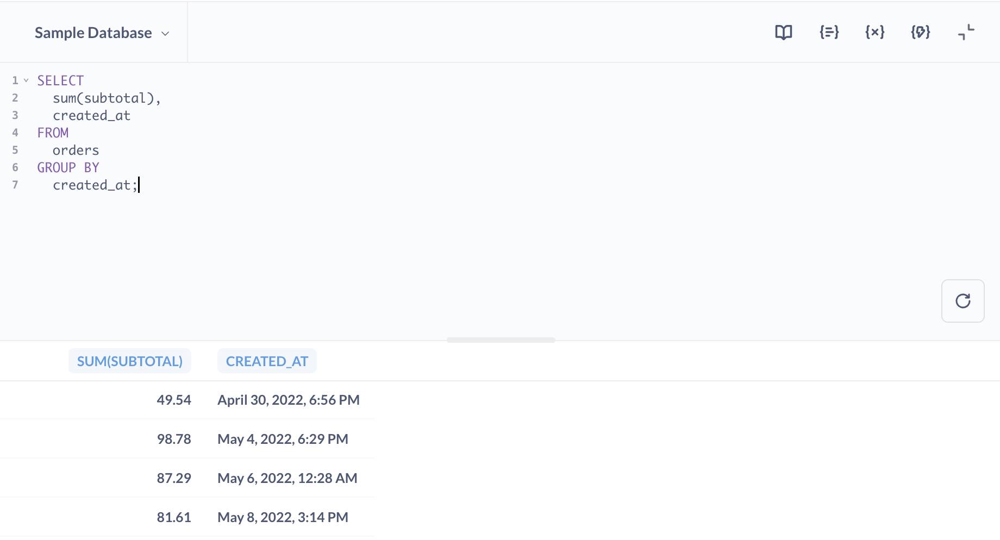

# SQL-Editor


Wenn Sie einmal Fragen stellen müssen, die sich nicht mit dem Query Builder ausdrücken lassen, können Sie stattdessen [SQL][sql-gloss] verwenden.


## Was ist SQL?


SQL (ausgesprochen "Sequel" oder manchmal auch S.Q.L. - darüber lässt sich streiten) steht für Structured Query Language (strukturierte Abfragesprache) und ist ein weit verbreiteter Standard zum Abrufen von Daten aus Datenbanken. Wir werden jetzt nicht versuchen, Ihnen alles über SQL beizubringen, aber um mehr darüber zu erfahren, lesen Sie [Working with SQL][learn-sql].


Auch wenn du SQL nicht verstehst oder nicht weißt, wie man es benutzt, lohnt es sich, eine Vorstellung davon zu bekommen, wie es in der Metabase funktioniert, denn manchmal werden andere Leute SQL-basierte Fragen stellen, die für dich nützlich sein könnten.


## Starten einer neuen SQL-Abfrage


Wählen Sie **+ Neu** in der Hauptnavigationsleiste. Wenn Sie über die [Rechte](../../permissions/data.md) zur Verwendung des SQL-Editors verfügen, sehen Sie neben einem kleinen Konsolensymbol eine Option zum Starten einer neuen**SQL-Abfrage**.


Wenn Sie auf**SQL-Abfrage** klicken, sehen Sie einen Editor, in dem Sie Abfragen in SQL (oder der nativen Abfragesprache Ihrer Datenbank) schreiben und ausführen können.





Um es auszuprobieren, vergewissern Sie sich, dass Sie die [Beispieldatenbank][sample-database-gloss] ausgewählt haben, und fügen Sie dann diese kurze SQL-Abfrage ein:


```sql
SELECT
sum(Zwischensumme),
erstellt_am
FROM aufträge
GROUP BY erstellt_am;
```


Machen Sie sich keine Sorgen, wenn Sie das noch nicht verstanden haben. Klicken Sie auf die blaue Schaltfläche **Abfrage ausführen**, um Ihre Abfrage auszuführen.


Sie werden feststellen, dass die Tabelle, die zurückkommt, die gleiche ist, wie wenn Sie den [query builder](../query-builder/editor.md) verwendet hätten, um die Summe der `Zwischensumme` in der Tabelle `Bestellungen`, gruppiert nach dem `Erstellt am` Datum, abzufragen.


### Ausführen von Abfrageauswahlen


Sie können Ihre SQL-Abfrage ausführen, indem Sie **ctrl + enter** unter Windows und Linux oder **⌘ + return** auf einem Mac drücken. Sie können auch nur einen Teil einer Abfrage ausführen, indem Sie den Teil, den Sie ausführen möchten, markieren, bevor Sie auf die Schaltfläche Ausführen klicken, oder die Tastenkombination Ausführen verwenden.


Mit SQL gestellte Fragen können gespeichert, heruntergeladen, in Modelle umgewandelt und zu Dashboards hinzugefügt werden, genau wie Fragen, die mit dem Query Builder gestellt wurden.


Sie können auch [auf Modelle und gespeicherte Fragen verweisen][ref-models] in Ihren SQL-Abfragen.


## Verwenden Sie den Operator`??` anstelle von `?`


Wenn Sie den JSON-Operator `?` in PostgreSQL verwenden, benutzen Sie stattdessen den entsprechenden Operator `??`.


Dies liegt an den Einschränkungen von JDBC, das ein einzelnes Fragezeichen `?` als Parameterplatzhalter interpretiert.


## SQL-Abfragen formatieren


Sie können Ihre SQL-Abfragen formatieren, indem Sie auf das Symbol "Dokument" in der Seitenleiste des Editors klicken.


**Vor dem Formatieren**:


```sql
select sum(zwischensumme),
created_at from orders group by created_at;
```


**Nach Format**:


```sql
SELECT
