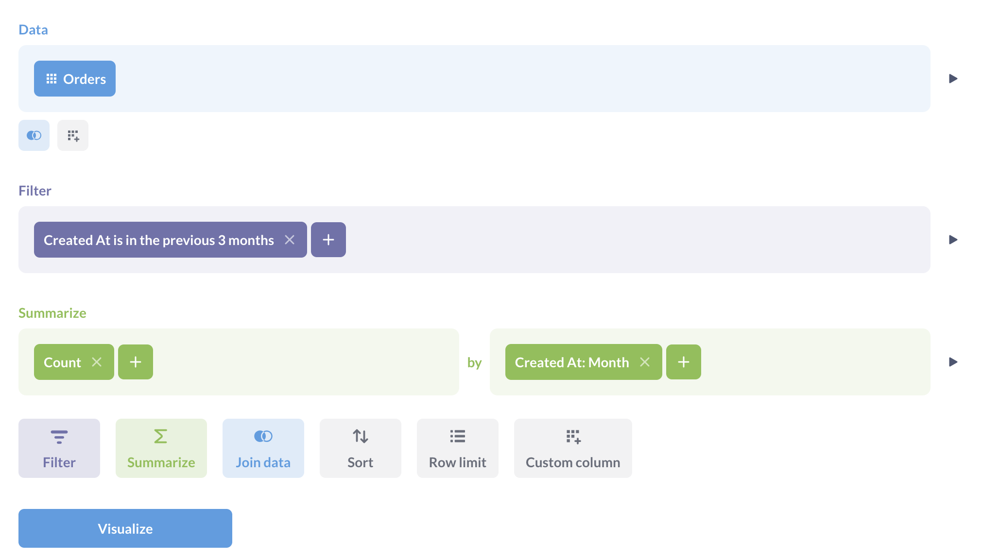

# Der Abfragegenerator

Metabase enthält einen grafischen Query Builder, mit dem Sie interaktive Diagramme erstellen können.

Mit dem Query Builder können Sie:

- [Daten auswählen](#picking-data)
- [Tabellen verbinden](#joining-data)
- [Benutzerdefinierte Spalten erstellen](#custom-columns)
-Daten filtern](./filters.md)
- [Daten zusammenfassen und gruppieren](./summarizing-and-grouping.md)
- [Ergebnisse begrenzen](#setting-a-row-limit)

Bei der Anzeige eines Diagramms können Sie auch durch Fragen klicken, um die Daten genauer zu untersuchen.

[Drill-through-Menü](../images/drill-through-menu.png)

Das Drill-Through-Menü zeigt verschiedene Optionen an, je nachdem, worauf Sie klicken. Sie können dann optional jede Erkundung als neue Frage speichern. Das vollständige Drill-Through-Menü ist nur für Fragen verfügbar, die mit dem Query Builder erstellt wurden. Fragen, die mit dem SQL/native-Editor erstellt wurden, verfügen nur über [eingeschränkte Drill-Through-Aktionen](../native-editor/writing-sql.md#drill-though-in-sql-questions). Mehr darüber, wie Drill-Through funktioniert, finden Sie unter [Erstellen interaktiver Diagramme](https://www.metabase.com/learn/metabase-basics/querying-and-dashboards/questions/drill-through).

## Erstellen einer neuen Frage mit dem Query Builder

Wählen Sie in der Dropdown-Liste **+ Neu** die Option **Frage** und wählen Sie dann Ihre Ausgangsdaten:

Sie können eine Frage mit folgenden Daten beginnen:

- **Einem Modell**. Ein [Modell](../../data-modeling/models.md) ist eine spezielle Art von gespeicherten Fragen, die als guter Ausgangspunkt für Fragen verwendet werden können. Manchmal werden sie auch als abgeleitete Tabellen bezeichnet, da sie normalerweise Daten aus mehreren Rohtabellen zusammenführen.
- **Eine Metrik**. [Metriken](../../data-modeling/metrics.md) sind vordefinierte Berechnungen. Wenn Sie eine Metrik als Ausgangspunkt für eine Frage auswählen, erstellt Metabase eine Frage mit derselben Datenquelle wie die ausgewählte Metrik und wendet die Metrik an. Sie können dann weitere Verknüpfungen, Filter und Zusammenfassungen hinzufügen.
- **Tabellen**. Sie müssen die Datenbank und die Tabelle in dieser Datenbank als Ausgangspunkt für Ihre Frage angeben.
- Eine **gespeicherte Frage**. Sie können die Ergebnisse einer beliebigen Frage als Ausgangspunkt für eine neue Frage verwenden.

Beachten Sie, dass es einige Arten von gespeicherten Fragen gibt, die nicht als Ausgangsdaten verwendet werden können:

- Druid-Fragen
- Mongo-Fragen
- Fragen, die Aggregationen "Kumulative Summe" oder "Kumulative Anzahl" verwenden
- Fragen, die Spalten haben, die den gleichen oder einen ähnlichen Namen haben, wie "Count" und "Count 2".

## Der Editor

Sobald Sie Ihre Daten ausgewählt haben, leitet Metabase Sie zum Editor des Query Builders weiter. Angenommen, Sie haben**Tabellen** >**Beispieldatenbank** >**Bestellungen** ausgewählt, dann sehen Sie etwa so aus:

Dies ist der Editor des Query Builders. Er hat drei Standardschritte.

- [Datenauswahl](#picking-data)
- [Filtern](./filters.md)
- [Zusammenfassen und Gruppieren nach](./summarizing-and-grouping.md)

Sie können auch Schritte für [Daten verknüpfen](./join.md), [benutzerdefinierte Spalten](#custom-columns), und [Ergebnisse sortieren](#sorting-results), und [Ergebnisse begrenzen](#setting-a-row-limit) hinzufügen.

Rechts von jedem abgeschlossenen Schritt befindet sich eine Schaltfläche**Vorschau** (sieht aus wie eine Schaltfläche "Play" - ein Dreieck, das nach rechts zeigt), die Ihnen die ersten 10 Zeilen der Ergebnisse Ihrer Frage bis zu diesem Schritt anzeigt.

[Vorschau der Ergebnisse](../images/preview-table.png)

## Auswahl der Daten

Im Abschnitt Daten wählen Sie die Daten aus, mit denen Sie arbeiten möchten. Hier wählen Sie ein [Modell](../../data-modeling/models.md), eine [Metrik](../../data-modeling/metrics.md), eine Tabelle aus einer Datenbank oder eine gespeicherte Frage.
