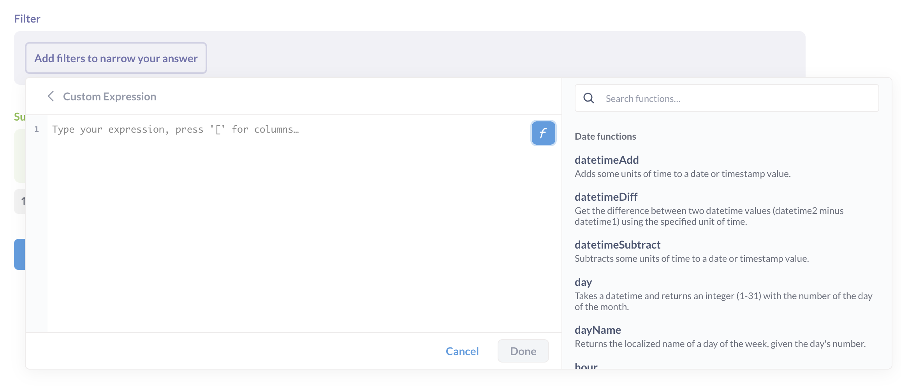
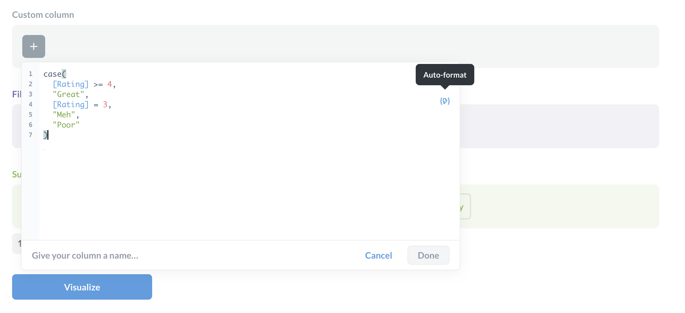

# Benutzerdefinierte Ausdrücke
[Editor für benutzerdefinierte Ausdrücke](../images/custom-expression-editor.png)
[Benutzerdefinierte Ausdrücke][expression-list] sind wie Formeln in Tabellenkalkulationsprogrammen wie Excel, Google Sheets und LibreOffice Calc. Sie sind die leistungsstarken Werkzeuge im Editor des Query Builders, mit denen Sie kompliziertere Fragen stellen können.
Sie können auch zur [vollständigen Liste der Ausdrücke][expression-list] springen.

## Benutzerdefinierte Ausdrücke zum Erstellen von Filtern, Metriken und benutzerdefinierten Spalten
Um den Editor für benutzerdefinierte Ausdrücke zu verwenden, erstellen Sie eine **Benutzerdefinierte Spalte** (wobei der benutzerdefinierte Ausdruck als Feldformel zur Berechnung von Werten für die neue Spalte verwendet wird), oder klicken Sie auf **Filter** oder **Zusammenfassen** und wählen Sie **Benutzerdefinierter Ausdruck**.
Wenn Sie den Abfragegenerator verwenden, können Sie Ausdrücke verwenden, um neue Spalten zu erstellen:
- **Benutzerdefinierte Spalten**. Sie können z. B. `[Zwischensumme] / [Menge]` verwenden, um eine neue Spalte zu erstellen, die Sie "Artikelpreis" nennen können.
- **Filter**. Der Ausdruck `enthält([Kommentar], "Metabase")` würde nach Zeilen filtern, in denen das Feld `Kommentar` das Wort "Metabase" enthält.
- **Zusammenfassungen**. Auch bekannt als Metriken oder Aggregationen. Anteil([Gesamt] > 50)` würde den Prozentsatz der Bestellungen mit einem Gesamtbetrag von mehr als 50 Dollar zurückgeben.
Geben Sie Ihren Ausdruck ein, geben Sie ihm einen Namen, und klicken Sie auf **Fertig**. Wenn die Schaltfläche Fertig ausgegraut ist, überprüfen Sie, ob Ihr Ausdruck gültig ist und ob Sie dem Ausdruck einen Namen gegeben haben (den Sie unten im Ausdruckseditor eingeben).
Auf dieser Seite werden die Grundlagen von Ausdrücken behandelt. Sie können sich eine [vollständige Liste der Ausdrücke][expression-list] in der Metabase ansehen oder ein Tutorial durchlaufen, das Ihnen zeigt, wie Sie [benutzerdefinierte Ausdrücke im Notizbuch-Editor][custom-expressions] verwenden können.

## Arten von Ausdrücken
Es gibt zwei grundlegende Arten von Ausdrücken, **Aggregationen** und **Funktionen**. Sehen Sie sich eine [vollständige Liste der Ausdrücke][expression-list] an.

### Aggregationen
[Aggregationen][Aggregationen] verwenden Werte aus mehreren Zeilen, um eine Berechnung durchzuführen, z. B. um den Durchschnittswert aller Werte in einer Spalte zu ermitteln. Aggregationsfunktionen können nur im Abschnitt **Zusammenfassen** des Notizbuch-Editors verwendet werden, da Aggregationen Werte aus allen Zeilen für diese Spalte verwenden. Während Sie also eine benutzerdefinierte Spalte mit der Formel "Zwischensumme" + "Steuer" erstellen können, können Sie nicht "Summe([Zwischensumme] + [Steuer])" schreiben, es sei denn, Sie erstellen einen benutzerdefinierten metrischen Ausdruck (der alle Zwischensummen und Steuern zusammenzählt).

### Funktionen
[Funktionen][Funktionen] hingegen machen etwas mit jedem Wert in einer Spalte, wie z.B. die Suche nach einem Wort in jedem Wert (`contains`), das Aufrunden jedes Wertes auf die nächste Ganzzahl (die Funktion `ceil`), und so weiter.

## Funktionsbrowser

Der Ausdruckseditor enthält einen Funktionsbrowser, der Ihnen hilft, die gewünschte Funktion zu finden. Um den Browser anzuzeigen, klicken Sie auf das **f** auf der rechten Seite des Ausdruckseditors. Siehe auch eine [Liste der Funktionen und Aggregationen](./expressions-list.md).

## Auto-Format

Um Ausdrücke zu formatieren, klicken Sie auf die Schaltfläche für die automatische Formatierung auf der rechten Seite des Ausdruckseditors (der Blitz in geschweiften Klammern).

## Grundlegende mathematische Operatoren
Verwenden Sie `+`, `-`, `*` (Multiplizieren), `/` (Dividieren) für numerische Spalten mit numerischen Werten, wie Ganzzahlen, Gleitkommazahlen und Double. Sie können Klammern, `(` und `)`, verwenden, um Teile Ihres Ausdrucks zu gruppieren.
Sie könnten zum Beispiel eine neue Spalte erstellen, die die Differenz zwischen der Gesamtsumme und der Zwischensumme eines Auftrags berechnet: [Gesamt] - [Zwischensumme]".
Um mit Zeitstempelspalten zu rechnen, können Sie [Datumsfunktionen](expressions-list.md#date-functions) wie [dateDiff](./expressions/datetimediff.md) verwenden.

## Bedingte Operatoren
- `AND`
- `OR`
- `NICHT`
- `>`
- `>=` (größer als oder gleich)
- `<`
- `<=` (kleiner als oder gleich)
- `=`
- `!=` (nicht gleich)
Sie könnten zum Beispiel einen Filter für Kunden aus Kalifornien oder Vermont erstellen: `[Staat] = "CA" OR [Staat] = "VT"`.
Sie können auch Bedingungen mit der Funktion `case` (alias `if`) verwenden:
```
case([Größe] = "L", "LARGE", [SIZE] = "M", "MEDIUM", "SMALL")
```
Siehe [`case`](./ausdrucke/case.md).

## Verweis auf andere Spalten
Sie können auf Spalten in der aktuellen Tabelle oder auf Spalten verweisen, die über eine Fremdschlüsselbeziehung verbunden sind. Spaltennamen sollten in eckigen Klammern angegeben werden, etwa so: `[Name der Spalte]`. Auf Spalten in verbundenen Tabellen kann wie folgt verwiesen werden: `[VerbundeneTabelleName.Spalte]`.

## Verweis auf Segmente und Metriken
Sie können auf gespeicherte [metrics](../../data-modeling/metrics.md) und [segments](../../data-modeling/segments.md) verweisen, die in der aktuell ausgewählten Tabelle vorhanden sind. Sie schreiben diese genauso aus wie bei den Spalten, etwa so: `[Gültige Benutzersitzungen]`.

## Filterausdrücke und Konditionale
Bei Filterausdrücken und Konditionalen sind einige Dinge zu beachten:
- Filterausdrücke unterscheiden sich insofern, als sie einen booleschen Wert zurückgeben müssen (etwas, das entweder wahr oder falsch ist). Sie könnten zum Beispiel schreiben: `[Zwischensumme] + [Steuer] < 100`. Metabase würde sich jede Zeile ansehen, die Zwischensumme und die Steuer addieren und prüfen, ob die Summe größer als 100 ist. Ist dies der Fall, wird die Anweisung als wahr bewertet, und Metabase nimmt die Zeile in das Ergebnis auf. Wenn Sie stattdessen (fälschlicherweise) `[Zwischensumme] + [Steuer]` schreiben würden, wüsste Metabase nicht, was zu tun ist, da dieser Ausdruck nicht als wahr oder falsch ausgewertet wird.
- Sie können Funktionen innerhalb des bedingten Teils der `CountIf`- und `SumIf`-Aggregationen verwenden, etwa so: CountIf( round([Zwischensumme]) > 100 OR floor([Steuer]) < 10 )`.
- 
## Arbeiten mit Daten in Filterausdrücken
Wenn Sie mit Datumsangaben in Ihren Filterausdrücken arbeiten möchten, müssen die Datumsangaben dem Format "JJJJ-MM-TT" entsprechen, d. h. vier Zeichen für das Jahr, zwei für den Monat und zwei für den Tag, eingeschlossen in Anführungszeichen "" und getrennt durch Bindestriche "-".

Beispiel:
`zwischen([Erstellt am], "2020-01-01", "2020-03-31") OR [Empfangen am] > "2019-12-25"`
Dieser Ausdruck würde Zeilen zurückgeben, bei denen "Erstellt am" zwischen dem 1. Januar 2020 und dem 31. März 2020 liegt oder bei denen "Empfangen am" nach dem 25. Dezember 2019 liegt.

## Liste der Ausdrücke
Siehe eine vollständige Liste der [Ausdrücke][expression-list].
Eine Anleitung zu Ausdrücken finden Sie unter [Benutzerdefinierte Ausdrücke im Query Builder][custom-expressions].
[Aggregationen]: ./expressions-list.md#aggregations
[Benutzerdefinierte Ausdrücke]: https://www.metabase.com/learn/metabase-basics/querying-and-dashboards/questions/custom-expressions
[Ausdrucksliste]: ./expressions-list.md
[Funktionen]: ./expressions-list.md#functions
