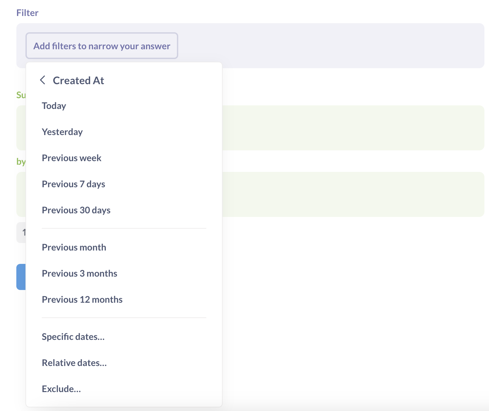
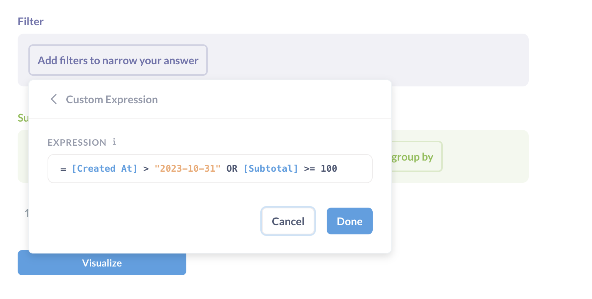

# Filtern
Filtern bedeutet, Dinge nach bestimmten Kriterien einzugrenzen. Wahrscheinlich kennen Sie das Filtern bereits, wenn Sie online nach etwas suchen, z. B. beim Einkaufen. Vielleicht wollen Sie nur olivfarbene Hosen sehen oder Bücher, deren Autor mit Nachnamen "Borges" heißt, oder Bilder von Menschen, die olivfarbene Hosen tragen und Jorge Luis Borges lesen.

Wenn Sie einen Filterschritt hinzufügen, können Sie eine oder mehrere Spalten auswählen, nach denen gefiltert werden soll. Je nach [Datentyp](https://www.metabase.com/learn/grow-your-data-skills/data-fundamentals/data-types-overview) der ausgewählten Spalte erhalten Sie verschiedene [Filtertypen](#filter-types), z. B. einen Kalender für Datumsspalten.
Nach jedem Zusammenfassungsschritt können Sie weitere Filterschritte hinzufügen. So können Sie z. B. nach der Anzahl der Zeilen pro Monat zusammenfassen und dann einen Filter auf die Spalte "Anzahl" anwenden, um nur Zeilen einzuschließen, deren Anzahl größer als 100 ist. (Dies ist im Grunde wie eine SQL `HAVING`-Klausel.)
Wenn Sie mit Ihrem Filter zufrieden sind, klicken Sie auf **Filter hinzufügen**, und zeigen Sie Ihre Ergebnisse an. Ihre Daten werden mit dem angewandten Filter aktualisiert.
Wenn Sie Ihren Filter bearbeiten möchten, klicken Sie einfach auf den kleinen lila Filter am oberen Bildschirmrand. Wenn Sie auf das X klicken, wird der Filter entfernt. Sie können so viele Filter hinzufügen, wie Sie benötigen.

*# Filtertypen
Je nach Datentyp der Spalte bietet die Metabase unterschiedliche Filteroptionen an.
- Bei **Numerischen Spalten** können Sie Filter hinzufügen, um nur die Zeilen in Ihre Tabelle aufzunehmen, bei denen diese Zahl zwischen zwei bestimmten Werten liegt, größer oder kleiner als ein bestimmter Wert ist oder genau gleich einem Wert ist.
- Mit **Text- oder Kategoriespalten** können Sie angeben, dass Sie nur Daten einbeziehen wollen, bei denen diese Spalte eine bestimmte Option ist oder nicht, ob sie eine Teilzeichenkette enthält, mit ihr beginnt oder endet oder ob die Zeile leer ist oder nicht.
- **Datenspalten** bieten Ihnen eine Vielzahl von Optionen zum Filtern nach bestimmten Datumsbereichen, relativen Datumsbereichen und mehr.
- **Strukturierte Datenspalten**, typischerweise JSON oder XML, können nur nach "Ist leer" oder "Nicht leer" gefiltert werden. Einige Datenbanken unterstützen jedoch die [JSON-Entfaltung] (../../data-modeling/json-unfolding.md), mit der Sie JSON-Daten in separate Spalten aufteilen können, nach denen Sie dann filtern können.
- Die Spalten **Breitengrad und Längengrad** haben die gleichen Optionen wie numerische Spalten, aber auch einen speziellen "Inside"-Filtertyp, mit dem Sie gleichzeitig nach Breitengrad und Längengrad filtern können.
  
## Filtern nach Datum
Ein wichtiger Punkt beim Filtern nach einer Datumsspalte ist der Unterschied zwischen spezifischen und relativen Daten:
- **Spezifische Daten** sind z. B. der 1. November 2010 oder der 3. Juni bis 12. Juli 2017; sie beziehen sich immer auf dasselbe Datum bzw. dieselben Daten.
- Relative Datumsangaben** sind Dinge wie "die letzten 30 Tage" oder "die aktuelle Woche"; im Laufe der Zeit _verändern_ sich die Daten, auf die sich diese Optionen beziehen. Relative Datumsangaben sind eine nützliche Methode, um einen Filter für eine Frage einzurichten, so dass sie aktuell bleibt, indem Sie z. B. anzeigen, wie viele Personen Ihre Website in den letzten 7 Tagen besucht haben. Sie können auch auf **...** klicken, um eine Option **Beginnend von** anzugeben, mit der Sie den relativen Datumsbereich verschieben können. Sie können zum Beispiel den Bereich "Die letzten 7 Tage, beginnend vor 2 Tagen" festlegen.

## Filter mit benutzerdefinierten Ausdrücken

Wenn Sie einen komplexeren Filter haben, den Sie ausdrücken möchten, können Sie [Benutzerdefinierter Ausdruck](./expressions.md) aus dem Menü "Filter hinzufügen" auswählen, um einen Filterausdruck zu erstellen. Sie können Vergleichsoperatoren wie "größer als", ">" oder "kleiner als", "<" sowie kalkulationsähnliche Funktionen verwenden. Zum Beispiel: `[Zwischensumme] > 100 OR Median([Alter]) < 40`.
Erfahren Sie mehr über das Schreiben von [Ausdrücken](./expressions.md) oder springen Sie direkt zur [Liste der Ausdrücke](./expressions-list.md).

## Filtern nach einem Segment
Wenn Ihre Metabase-Administratoren spezielle benannte Filter für die angezeigte Tabelle erstellt haben, werden diese oben im Filter-Dropdown in lila Text mit einem Stern daneben angezeigt. Diese heißen [**Segmente**] (../../data-modeling/segments.md) und sind Abkürzungen für eine Kombination von Filtern, die in Ihrem Unternehmen häufig verwendet werden. Sie könnten zum Beispiel "Aktive Benutzer" oder "Beliebteste Produkte" heißen.
