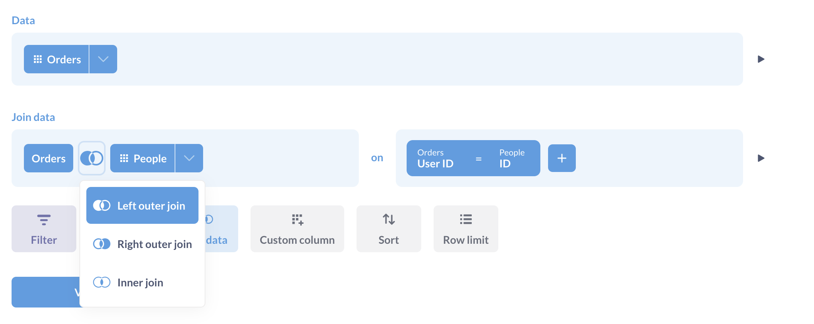
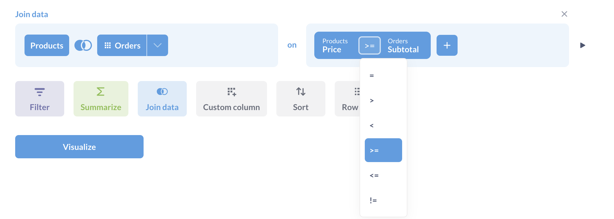

# Daten verknüpfen

Sie können [Daten verbinden][verbinden], um Ihre aktuellen Daten mit einer anderen Tabelle oder sogar mit einer gespeicherten Frage zu kombinieren.
Nachdem Sie auf die Schaltfläche Daten verknüpfen geklickt haben, um einen Verknüpfungsschritt hinzuzufügen, müssen Sie die Daten (aus derselben Datenbank) auswählen, die Sie verknüpfen möchten. Sie können nur Tabellen und gespeicherte Fragen auswählen, die aus derselben Datenbank stammen wie Ihre Ausgangsdaten.
[Auswahl der zu verknüpfenden Daten](../images/join-pick-data.png)
Als nächstes müssen Sie die Spalten auswählen, die Sie verknüpfen möchten. Das bedeutet, dass Sie eine Spalte aus der ersten Tabelle und eine Spalte aus der zweiten Tabelle auswählen, und die Verknüpfung wird Zeilen zusammenfügen, bei denen der Wert der ersten Spalte gleich dem Wert der zweiten Spalte ist. Ein sehr häufiges Beispiel ist der Join über eine ID-Spalte in jeder Tabelle. Wenn Sie also eine Tabelle für den Join auswählen, in der eine Fremdschlüsselbeziehung zwischen den Tabellen besteht, wählt Metabase automatisch die entsprechenden ID-Spalten für Sie aus. Am Ende des Verknüpfungsschritts gibt es eine Schaltfläche "Spalten", über die Sie auswählen können, welche Spalten Sie in die verknüpften Daten aufnehmen möchten.
Standardmäßig führt Metabase einen Left Outer Join durch, aber Sie können auf das Venn-Diagramm-Symbol klicken, um eine andere Art von Join auszuwählen. Nicht alle Datenbanken unterstützen alle Arten von Verknüpfungen, daher zeigt Metabase nur die Optionen an, die von der verwendeten Datenbank unterstützt werden.
Hier sind die grundlegenden Arten von Verknüpfungen:
- **Linke äußere Verknüpfung:** Wählen Sie alle Datensätze aus Tabelle A zusammen mit den Datensätzen aus Tabelle B aus, die die Verknüpfungsbedingung erfüllen, falls vorhanden.
- **Rechte äußere Verknüpfung:** Wählen Sie alle Datensätze aus Tabelle B zusammen mit Datensätzen aus Tabelle A aus, die die Verknüpfungsbedingung erfüllen, sofern vorhanden.
- Innere Verknüpfung:** Wählt nur die Datensätze aus Tabelle A und B aus, bei denen die Verknüpfungsbedingung erfüllt ist.
- Vollständige äußere Verknüpfung:** Wählen Sie alle Datensätze aus beiden Tabellen aus, unabhängig davon, ob die Verknüpfungsbedingung erfüllt ist oder nicht.
**Beispiel für eine linke äußere Verknüpfung:** Wenn Tabelle A "Bestellungen" und Tabelle B "Kunden" ist und Sie eine Verknüpfung durchführen, bei der die Spalte "customer_id" in "Bestellungen" gleich der Spalte "ID" in "Kunden" ist, ist Ihr Ergebnis bei einer linken äußeren Verknüpfung eine vollständige Liste aller Bestellungen, und in jeder Bestellungszeile werden auch die Spalten des Kunden angezeigt, der diese Bestellung aufgegeben hat. Da ein einziger Kunde viele Bestellungen aufgeben kann, können die Informationen eines bestimmten Kunden in verschiedenen Bestellungszeilen viele Male wiederholt werden. Wenn es für eine bestimmte Bestellung keinen entsprechenden Kunden gibt, werden die Informationen zu dieser Bestellung angezeigt, aber die Kundenspalten sind für diese Zeile leer.

## Mehrere Stufen von Joins
In vielen Fällen kann es vorkommen, dass Sie Tabellen A, B und C haben, wobei A und B eine Verbindung haben und B und C eine Verbindung haben, aber A und C nicht. Wenn Sie A mit B mit C verbinden möchten, müssen Sie nur mehrere Verbindungsschritte hinzufügen. Klicken Sie auf Daten verknüpfen, verknüpfen Sie Tabelle A mit Tabelle B, klicken Sie dann auf den Schritt Daten verknüpfen unter diesem abgeschlossenen Verknüpfungsblock, um einen zweiten Verknüpfungsschritt hinzuzufügen, und verknüpfen Sie die Ergebnisse Ihrer letzten Verknüpfung mit Tabelle C.
Eine Verknüpfung von A nach B nach C](../images/join-a-b-c.png)

## Verknüpfung über mehrere Bedingungen
Ihre Verknüpfungen können auch mehrere Bedingungen enthalten, um Ihre Ergebnisse zu verfeinern. Die Metabase kombiniert mehrere Bedingungen mit dem Operator "AND".
Tabellen über mehrere Spalten verknüpfen](../images/joining-on-multiple-columns.png)

## Verknüpfung mit verschiedenen Operatoren
Sie können Tabellen anhand von Vergleichsbedingungen verknüpfen, wie z. B:
- `=` (gleich)
- `≠` (nicht gleich)
- `>` (größer als)
- `≥` (größer als oder gleich)
- `<` (kleiner als)
- `≤` (kleiner als oder gleich)

## Weitere Lektüre
- [Joins in der Metabase][join]
- [Typ von Joins][join-types]
[join]: https://www.metabase.com/learn/metabase-basics/querying-and-dashboards/questions/joins-in-metabase
[join-types]: https://www.metabase.com/learn/sql/working-with-sql/sql-join-types
