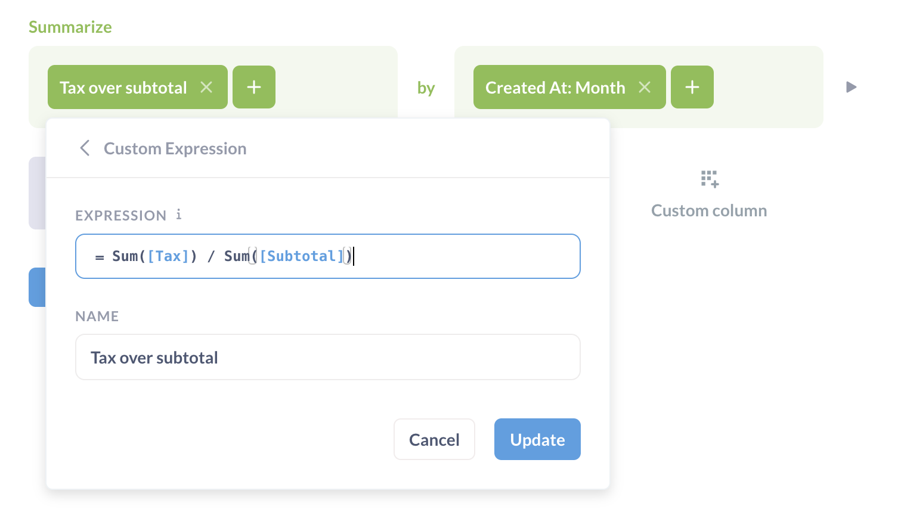
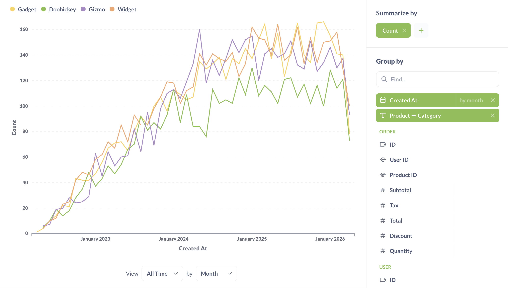

# Zusammenfassen und gruppieren

Wenn wir eine Frage wie "Wie viele Personen haben unsere App letzte Woche jeden Tag heruntergeladen?" stellen, benötigen wir eine **Zusammenfassung** der Daten. Eine Zusammenfassung besteht in der Regel aus zwei Teilen: einer oder mehreren _Zahlen_, die uns interessieren (in der Datensprache "Metrik" genannt), und der Art und Weise, wie wir diese Zahlen _gruppiert_ oder _aufgeschlüsselt_ sehen wollen. Um die Beispielfrage zu beantworten: "Wie viele Personen haben unsere App in der letzten Woche jeden Tag heruntergeladen?"
- Die Metrik wäre die Anzahl der Personen, die die App heruntergeladen haben (die Anzahl der Zeilen).
- Wir möchten, dass diese Metrik nach "jeden Tag" gruppiert wird.
- Und wir wollen die Zeilen nach "letzte Woche" filtern.
Es gibt zwei gängige Methoden, um Ihre Daten zusammenzufassen:
- Zählen der Anzahl der Zeilen in Ihrer Tabelle
- Ermitteln der Summe oder des Durchschnitts einer numerischen Spalte
Oftmals werden Sie diese Metrik dann **gruppieren** nach:
- Zeit
- Ort
- Kategorie

## Zusammenfassende Metriken
Wenn Sie einen Zusammenfassungsschritt hinzufügen, können Sie wählen, wie die Daten aus dem vorherigen Schritt aggregiert werden sollen. Sie können eine oder mehrere Metriken auswählen und diese Metriken optional nach einer oder mehreren Dimensionen (Spalten) gruppieren. Bei der Auswahl der Messgrößen können Sie aus grundlegenden Funktionen wie "Summe", "Durchschnitt" und "Anzahl" wählen, oder Sie können eine allgemeine, von einem Administrator definierte Messgröße wählen, oder Sie können einen [benutzerdefinierten Ausdruck] (./expressions.md) erstellen, indem Sie eine Formel schreiben.
Übliche Metriken sind:
- **Zahl der Zeilen:** die Gesamtzahl der Zeilen in der Tabelle, nachdem alle Filter angewendet wurden. Wenn Sie Ihre Tabelle "Bestellungen" betrachten und wissen möchten, wie viele Bestellungen mit einem Preis von mehr als 40 US-Dollar aufgegeben wurden, würden Sie nach "Preis größer als 40" filtern und dann "Anzahl der Zeilen" auswählen, da Metabase zählen soll, wie viele Bestellungen Ihrem Filter entsprechen.
- **Summe von ...:** die Summe aller Werte in einer bestimmten Spalte.
- **Durchschnitt von ...:** Der Durchschnitt aller Werte in einer einzelnen Spalte.
- **Anzahl der eindeutigen Werte von...:** die Anzahl der eindeutigen Werte in allen Zellen einer einzelnen Spalte. Dies ist nützlich, wenn man z. B. herausfinden will, wie viele verschiedene _Produkttypen_ im letzten Monat verkauft wurden (nicht wie viele insgesamt verkauft wurden).
- **Kumulative Summe von...:** Damit erhalten Sie eine laufende Summe für eine bestimmte Spalte. Damit diese Metrik nützlich ist, müssen Sie sie nach einer Datumsspalte gruppieren, um sie über die Zeit zu sehen.
- **Kumulative Zeilenzahl:** Hier erhalten Sie eine laufende Gesamtsumme der Anzahl der Zeilen in der Tabelle über die Zeit. Genau wie bei "Kumulierte Summe von..." müssen Sie diese Angabe nach einer Datumsspalte gruppieren, damit sie nützlich ist.
- **Standardabweichung von ...:** Eine Zahl, die ausdrückt, wie stark die Werte einer Spalte plus oder minus vom Durchschnittswert dieser Spalte abweichen.
- **Minimum von ...:** Der Mindestwert im ausgewählten Feld.
- Maximalwert von ...:** Der Maximalwert des ausgewählten Feldes.
Wenn Sie verdichten und eine Gruppierung hinzufügen, können Sie anschließend _wieder_ verdichten. Sie können auch Schritte zum Filtern und/oder Verknüpfen dazwischen schalten. Beispielsweise könnte Ihr erster Verdichtungsschritt darin bestehen, die Anzahl der Bestellungen pro Monat zu ermitteln, und Sie könnten dann einen zweiten Verdichtungsschritt hinzufügen, um die durchschnittliche monatliche Bestellsumme zu ermitteln, indem Sie die Spalte "Durchschnitt von..." Ihrer "Anzahl" auswählen.
Mehrere Zusammenfassungsschritte](../images/multiple-summarize-steps.png)
Sie können auch Metriken und Gruppierungen auf der Ergebnisseite in einer Seitenleiste hinzufügen: oben in der Seitenleiste wählen Sie die Zahl ("Metrik") aus, die Sie sehen möchten, und im unteren Teil wählen Sie aus, wie diese Zahl gruppiert werden soll (oder wie sie "aufgeteilt" werden soll).
Wenn Ihre Administratoren benannte [Metriken] (../../data-modeling/metrics.md) erstellt haben, die spezifisch für Ihr Unternehmen oder Ihre Organisation sind, befinden sie sich in dieser Dropdown-Liste unter dem Abschnitt **Gemeinsame Metriken**. Dabei kann es sich z. B. um die offizielle Methode Ihres Unternehmens zur Berechnung der Einnahmen handeln.

## Gruppierung Ihrer Metriken
Je nachdem, welche Gruppierungsspalte Sie auswählen, zeigt Metabase die ihrer Meinung nach beste Standardvisualisierung oder das beste Diagramm für diese Zusammenfassung an. Wenn Sie also eine Datumsspalte auswählen, wird ein Liniendiagramm wie dieses angezeigt (Sie können auf die grüne Schaltfläche **Zusammenfassen** klicken, um die Seitenleiste für die Zusammenfassung anzuzeigen).
Gruppierung nach einer Datumsspalte](../images/summarize-timeseries.png)
Wenn Sie auf eine andere Gruppierungsspalte klicken als die, die Sie gerade ausgewählt haben, wird die Gruppierung stattdessen auf diese Spalte umgestellt. Wenn Sie jedoch eine zusätzliche Gruppierung _hinzufügen_ möchten, klicken Sie einfach auf das Plus-Symbol (+) auf der rechten Seite der Spalte. Um eine Gruppierung zu entfernen, klicken Sie auf das X-Symbol.

Bei einigen Gruppierungsspalten haben Sie die Möglichkeit zu wählen, wie groß oder klein die Gruppierungen sein sollen:
- Bei Datumsspalten können Sie auf das Wort "nach Monat" klicken, um die Gruppierung in Tag, Woche, Stunde, Quartal, Jahr usw. zu ändern. Sie können auch mehrere Untergliederungen für dieselbe Datumsspalte mit unterschiedlicher zeitlicher Granularität hinzufügen (z. B. Gruppierung nach Woche und Wochentag). Informationen zur Gruppierung nach Woche des Jahres finden Sie unter [Woche des Jahres](./expressions/week.md).
- Bei numerischen Spalten, wie z. B. dem Alter, ordnet Metabase die Ergebnisse automatisch in Altersgruppen ein, z. B. 0-10, 11-20, 21-30, usw. Genau wie bei den Daten können Sie auf die aktuelle Einteilungsoption klicken, um eine bestimmte Anzahl von Einteilungen zu wählen. Derzeit können Sie keine eigenen Bereiche für die Einteilung wählen.
  
  Wenn Sie eine feste Anzahl von Bins auswählen, unterteilt Metabase den Bereich der Daten in diese Anzahl gleich großer Intervalle. Es kann vorkommen, dass einige Intervalle keine Daten enthalten, und Metabase zeigt sie nicht an.
