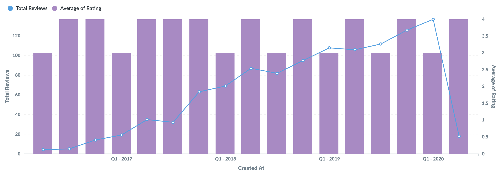
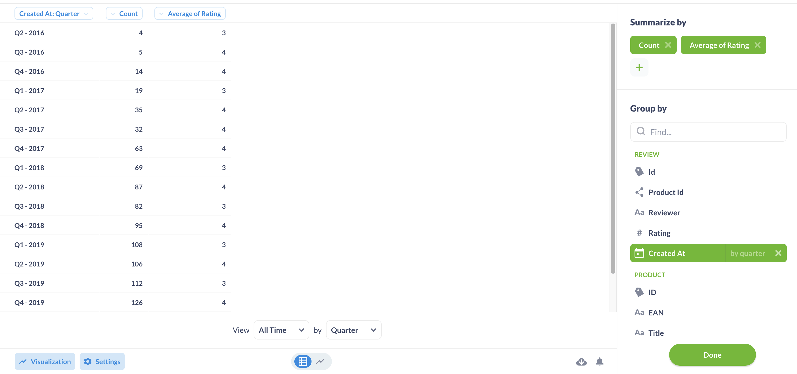
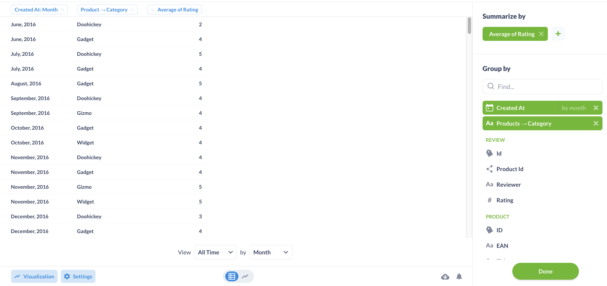

# Combo-Charts

Mit Kombi-Diagrammen können Sie Balken und Linien (oder Flächen) in einem Diagramm kombinieren.

Metabase wählt eine Ihrer Reihen aus, die als Linie angezeigt wird, und eine andere, die als Balken dargestellt wird. Öffnen Sie die Visualisierungseinstellungen, um zu ändern, welche Serien als Linien, Balken oder Flächen dargestellt werden sollen, und um die Einstellungen für die einzelnen Serien, z. B. die Farben, zu ändern.

Um ein Kombidiagramm zu verwenden, müssen Sie entweder zwei oder mehr Kennzahlen im Abschnitt "Zusammenfassen nach" Ihrer Frage ausgewählt haben, mit einer oder zwei Gruppierungsspalten, etwa so:

Oder Sie benötigen eine Frage mit einer einzigen Kennzahl und zwei Gruppierungsspalten, etwa so:

