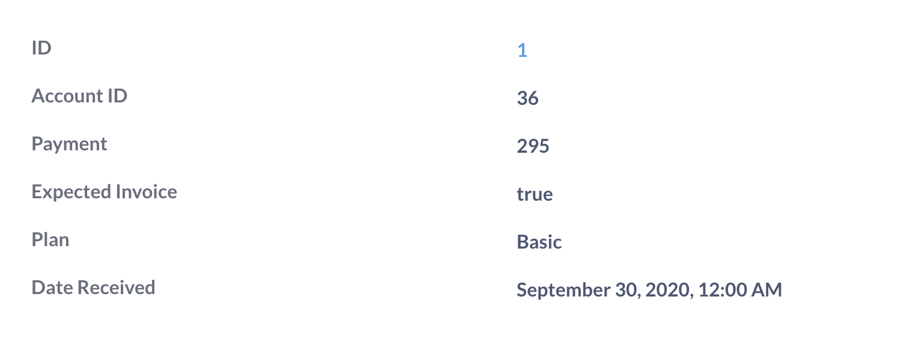

**Detail

Die**Detail** Visualisierung zeigt einen einzelnen Ergebnisdatensatz (Zeile) in einer leicht lesbaren, zweispaltigen Darstellung.

Mit den Pfeiltasten können Sie durch die Datensätze blättern.

