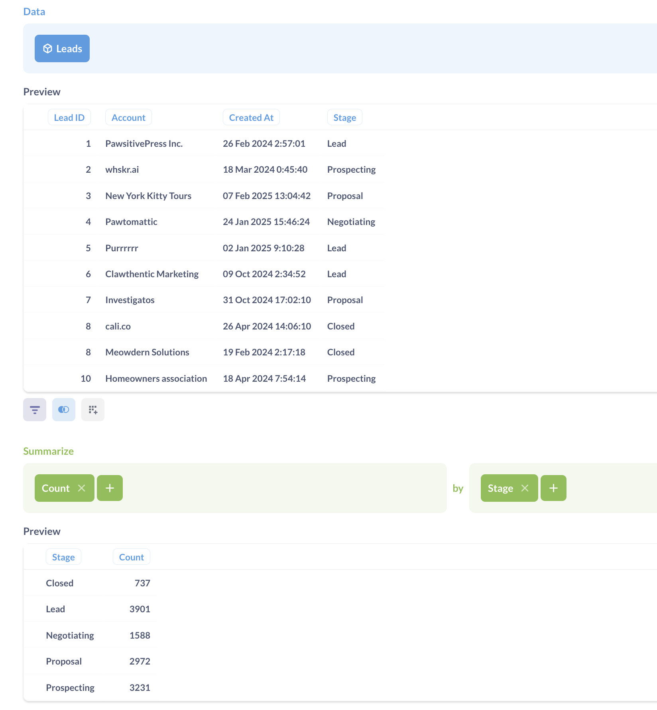
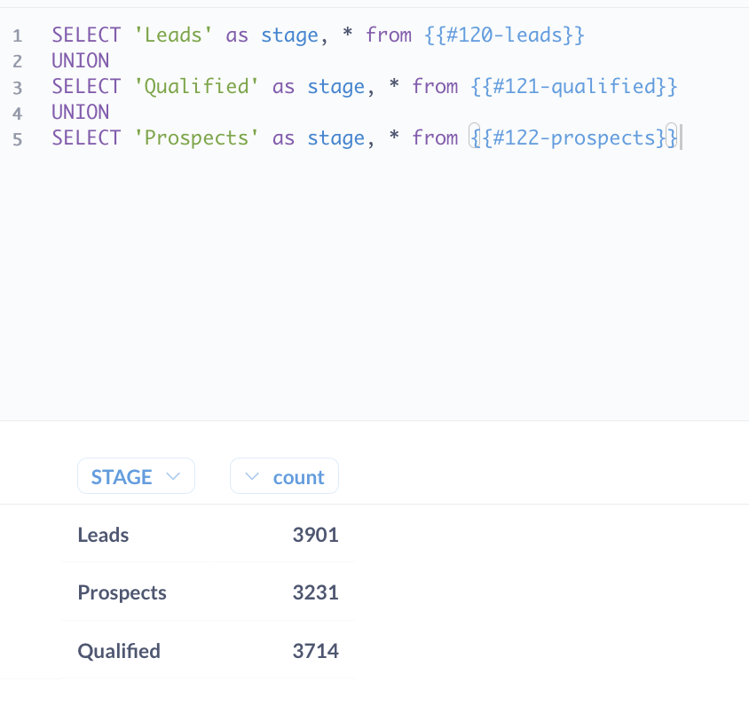

# Trichterdiagramme


Trichterdiagramme veranschaulichen, wie sich ein Wert durch eine Reihe von Schritten und die prozentuale Veränderung zwischen den Schritten aufgliedert.


[Trichter](../images/funnel.png)


Trichter werden häufig im E-Commerce oder im Vertrieb verwendet, um zu veranschaulichen, wie viele Kunden in jedem Schritt eines Kaufvorgangs oder Verkaufszyklus vorhanden sind. Trichter sind nur sinnvoll, wenn die Schritte sequentiell sind und die Kennzahl von einem Schritt zum nächsten abnimmt.


## Datenform für ein Trichterdiagramm


Um einen Trichter in der Metabase zu erstellen, benötigen Sie eine Tabelle mit mindestens zwei Spalten: Eine Spalte enthält die Schritte des Trichters und eine weitere Spalte die Metrik, an der Sie interessiert sind, z. B. die Anzahl der Kunden in diesem Schritt.


Hier ist die Datenform, die zum Erstellen des obigen Diagramms verwendet wurde:


| Stufe | Chancen |
| ------------- | ------------- |
| Leads | 3901 |
| Qualifizierung | 3714 |
| Prospecting | 3231 |
| Vorschlag | 2972 |
| Verhandlung | 1588 |
| Geschlossen | 737 |


Wenn Sie mehrere Spalten in Ihren Abfrageergebnissen haben, können Sie in den [Dateneinstellungen](#funnel-chart-settings) auswählen, welche Spalten für die Trichterschritte und die Metrik verwendet werden sollen.


Standardmäßig stellt Metabase die Schritte in der gleichen Reihenfolge dar, wie sie im Abfrageergebnis erscheinen, aber Sie können die Schritte in den [Dateneinstellungen](#funnel-chart-settings) neu anordnen oder ausblenden.


## Erstellen einer Abfrage für ein Trichterdiagramm


Um eine Abfrage mit einem Ergebnis zu erstellen, das die für ein Trichterdiagramm erforderliche Form hat, müssen Sie Ihre Daten wahrscheinlich zusammenfassen.


Wenn Ihre (ursprünglichen, nicht aggregierten) Daten bereits ein Feld mit dem Schritt für jeden Datenpunkt enthalten, können Sie eine einfache Abfrage mit einer Aufschlüsselung nach Schritten erstellen:





Wenn die Daten für die verschiedenen Stufen des Trichters aus unterschiedlichen Tabellen stammen oder wenn Sie für jede Stufe unterschiedliche Filter oder Aggregationsregeln verwenden müssen, können Sie für jede Stufe separate Fragen erstellen und diese dann mit einer SQL-Abfrage kombinieren.


Beispiel: Sie könnten drei separate [query builder](../query-builder/editor.md) Fragen erstellen, die jeweils die Zählungen für die Stufen "Leads", "Qualification" und "Proposal" zurückgeben. Dann schreiben Sie eine [SQL-Abfrage](../native-editor/writing-sql.md), die [auf diese Fragen verweist](../native-editor/referencing-saved-questions-in-queries.md) und ` UNION` verwendet, um Ergebnisse in der richtigen Form für die Erstellung eines Trichterdiagramms zu erhalten.


``sql
-- Beispiel für eine Abfrage, die Ergebnisse von Fragen abruft und mit UNION kombiniert


SELECT 'Leads' as step, * from {{#120-leads}}
UNION
SELECT 'Qualified' as step, * from {{#121-qualified}}
UNION
SELECT 'Interessenten' as step, * from {{#122-prospects}}


```





## Wie man ein Trichterdiagramm liest


Trichterdiagramme zeigen den Wert der Kennzahl für jeden Schritt und wie die Kennzahl mit dem Wert beim _ersten_ Schritt verglichen wird. Die Metrik des ersten Schritts wird auf der linken Seite des Diagramms angezeigt.
