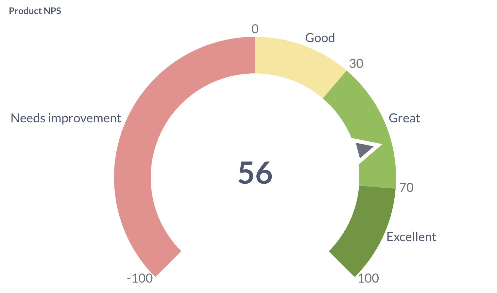
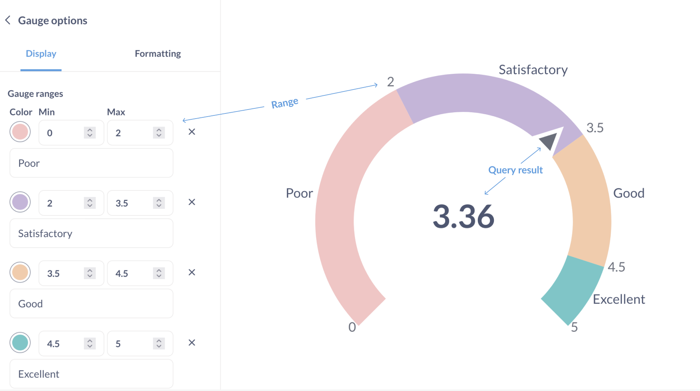
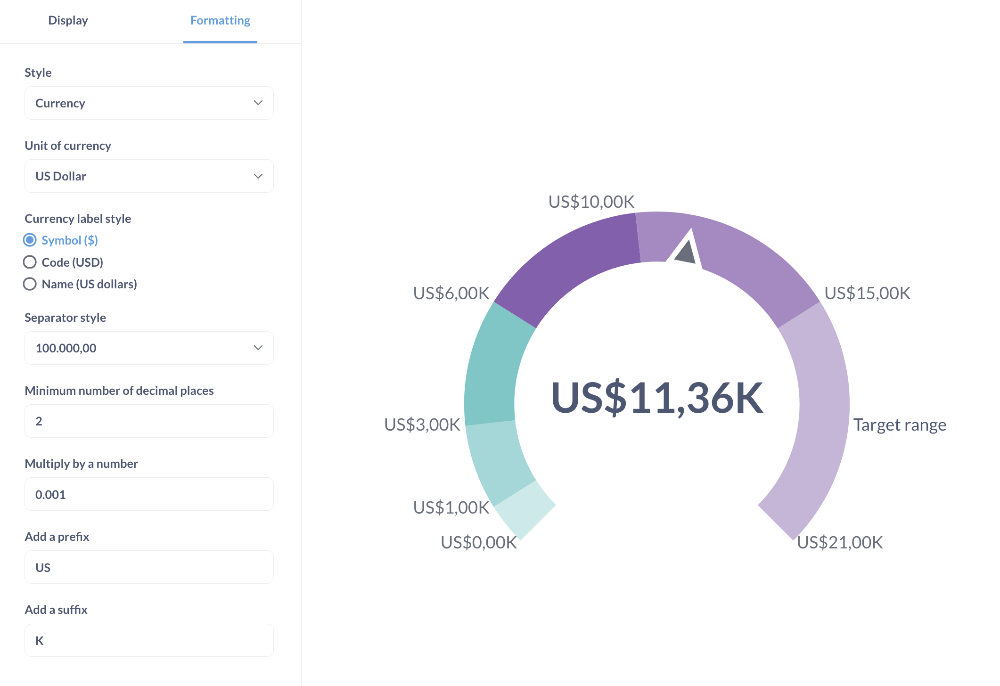

# Spurweite Tabelle

Ah, **Messgeräte**: entweder man liebt sie oder man hasst sie. ... Oder man findet sie eher uninteressant, denke ich. Wie dem auch sei, mit Gauges können Sie eine einzelne Zahl im Kontext einer Reihe von Farbbereichen anzeigen, die Sie festlegen können.

## Wann wird ein Messwertdiagramm verwendet?

Ein Messdiagramm ist nützlich, wenn Sie den Fortschritt oder den Status in verschiedenen Kategorien darstellen möchten.
Sie sind hilfreich für Leistungsmetriken, Risikobewertungen oder andere Metriken, die bestimmte Schwellenwerte haben.

## So erstellen Sie ein Messdiagramm

Um ein Messdiagramm zu erstellen, benötigen Sie:

- Eine Abfrage, die eine einzelne Zahl zurückgibt:

| Summe der Menge |
| --------------- |
| 4910 |

Sie können auch eine Abfrage verwenden, die mehrere Metriken in einer einzigen Zeile zurückgibt:

| Summe der Menge | Durchschnittliche Menge | Maximale Menge |
| --------------- | ---------------- | ------------ |
| 4910 | 17.32 | 173 |

In diesem Fall verwendet das Messgerätediagramm die Metrik in der ersten Spalte ("Summe der Menge"). Um die Metrik zu ändern, gehen Sie zum Editor und ziehen Sie die gewünschte Metrik an die erste Position im Block "Summe".

- Einen oder mehrere Bereiche für die Metrik, z. B. "Niedrig", "Mittel", "Hoch". Derzeit unterstützt Metabase nur die Definition statischer Bereiche (Sie können keine Bereichsgrenzen auf der Grundlage einer anderen Abfrage festlegen).

## Einstellungen für das Messgerätediagramm

In den Diagrammeinstellungen können Sie die Bereiche, deren Farben und optionale Beschriftungen festlegen.

Um die Diagrammeinstellungen zu öffnen, klicken Sie auf das Symbol **Visualisierung** unten links auf dem Bildschirm.

Die Formatierungsoptionen gelten sowohl für das Ergebnis der Abfrage als auch für die Bereichsgrenzen:

Insbesondere wendet das Messgerätediagramm die Option "Mit einer Zahl multiplizieren" auf die Bereichsgrenzen an. Wenn Sie also einen Bereich von 2000 bis 4000 im Diagramm anzeigen möchten, können Sie die Option "Mit einer Zahl multiplizieren: 1000" wählen und dann den zugrunde liegenden Bereich auf 2 bis 4 einstellen.

Die Auswahl von "Stil: Prozent" in den Formatierungsoptionen ändert nur, wie Metabase die Ergebnisse formatiert. Zum Beispiel wird "17" als "1700%" formatiert. Wenn Sie stattdessen das Abfrageergebnis als Prozentsatz des _Gesamtbereichs des Diagramms anzeigen möchten, müssen Sie diesen Prozentsatz in Ihrer Abfrage berechnen. Ein weiteres Beispiel: Um die Anzahl der Bestellungen als Prozentsatz von 20 anzuzeigen, verwenden Sie benutzerdefinierte Ausdrücke, um "Anzahl der Bestellungen geteilt durch 20" zurückzugeben, und formatieren Sie das Ergebnis als Prozentsatz.

## Beschränkungen und Alternativen

- Wenn Sie den Fortschritt einer Metrik innerhalb eines einzelnen Bereichs anzeigen möchten, sollten Sie stattdessen den [Fortschrittsbalken](./progress-bar.md) verwenden.

- Die Metabase unterstützt nicht die Einstellung von Warnungen, wenn sich eine Metrik von einem Bereich des Messdiagramms in einen anderen bewegt. Erwägen Sie die Verwendung eines [Fortschrittsbalkens](./progress-bar.md), um eine Warnung zu erstellen, wenn Ihre Metrik einen bestimmten Wert erreicht.

- Balkendiagramme unterstützen keine Ausbrüche. Je nach Anwendungsfall sollten Sie ein [Balkendiagramm mit einer Ziellinie](./line-bar-and-area-charts.md#goal-lines) verwenden.
