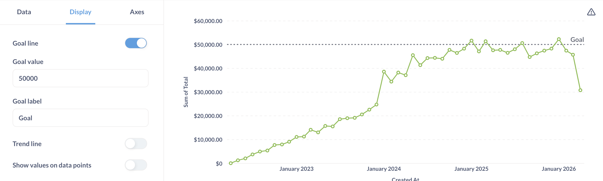
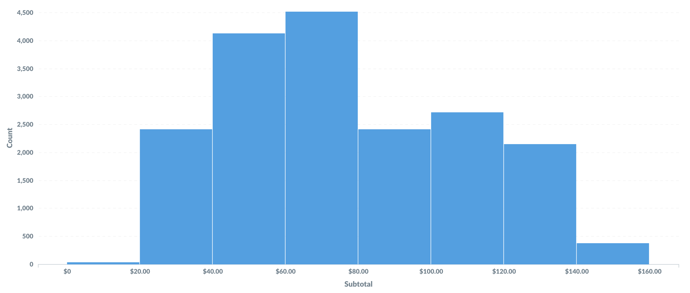
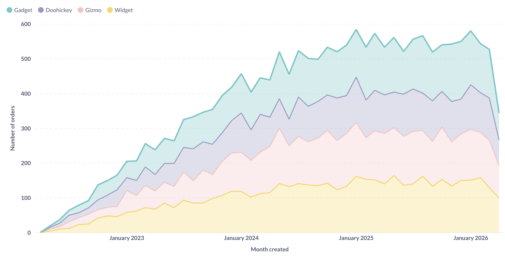

# Liniendiagramme, Balkendiagramme und Flächendiagramme

Sie sind ziemlich nützlich.

## Liniendiagramme

**Liniendiagramme eignen sich am besten für die Darstellung des Trends einer Zahl im Zeitverlauf, vor allem, wenn Sie viele Werte auf der x-Achse haben. Weitere Informationen finden Sie in unseren Tutorials [Leitfaden für Liniendiagramme](https://www.metabase.com/learn/metabase-basics/querying-and-dashboards/visualization/line-charts) und [Zeitreihenanalyse](https://www.metabase.com/learn/metabase-basics/querying-and-dashboards/time-series).

## Balkendiagramme

[Balkendiagramm](../images/bar.png)

Wenn Sie versuchen, eine Zahl nach einer Spalte zu gruppieren, die viele mögliche Werte hat, wie z. B. ein Feld "Lieferant" oder "Produkttitel", versuchen Sie es als **Zeilendiagramm** darzustellen. Metabase zeigt Ihnen die Balken in absteigender Reihenfolge der Größe an, mit einem letzten Balken am unteren Ende für die Elemente, die nicht passen.

[Zeilendiagramm](../images/row.png)

Bei einem Balkendiagramm wie "Anzahl der Benutzer nach Alter", bei dem die x-Achse eine Zahl ist, erhalten Sie eine spezielle Art von Diagramm, das **[Histogramm](https://www.metabase.com/learn/metabase-basics/querying-and-dashboards/visualization/histograms)**, bei dem jeder Balken einen Wertebereich (eine so genannte "Bin") darstellt. Beachten Sie, dass Metabase Ihre Ergebnisse immer dann automatisch einordnet, wenn Sie eine Zahl als Gruppierung verwenden, auch wenn Sie kein Balkendiagramm anzeigen. Fragen, die Längen- und Breitengrade verwenden, werden ebenfalls automatisch eingeteilt.

## Kombinierte Linien- und Balkendiagramme

Siehe [Kombinationsdiagramme](./combo-chart.md).

## Histogramme

Standardmäßig wählt Metabase automatisch ein geeignetes Verfahren zum Binning Ihrer Ergebnisse aus. Sie können jedoch die Anzahl der Bins für Ihr Ergebnis ändern oder das Binning ganz ausschalten, indem Sie auf den Bereich rechts neben der Spalte klicken, nach der Sie gruppieren möchten:

[Binning-Optionen](../images/histogram-bins.png)

## Flächendiagramme

**Flächendiagramme** sind nützlich, wenn man die Proportionen zweier Metriken über die Zeit vergleicht. Sowohl Balken- als auch Flächendiagramme können gestapelt werden.

## Einstellungen für Linien-, Balken- und Flächendiagramme

Diese drei Diagrammtypen verfügen über sehr ähnliche Optionen, die auf die folgenden Registerkarten aufgeteilt sind. Sie können auf diese Diagrammeinstellungen zugreifen, indem Sie auf das Symbol **Zahnrad** unten links im Diagramm klicken.

-Dateneinstellungen](#data-settings)
- [Anzeige-Einstellungen](#display-settings)
- [Achsen-Einstellungen](#axes-settings)

## Dateneinstellungen

Hier können Sie einstellen, wie die Daten angezeigt werden sollen.
