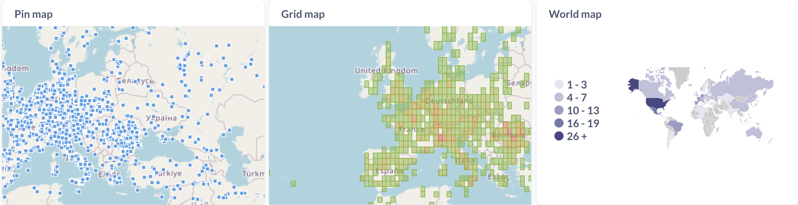
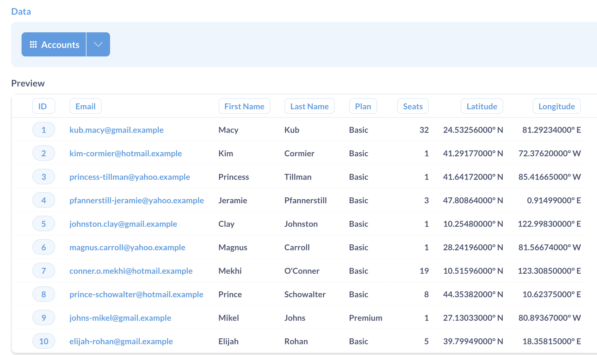
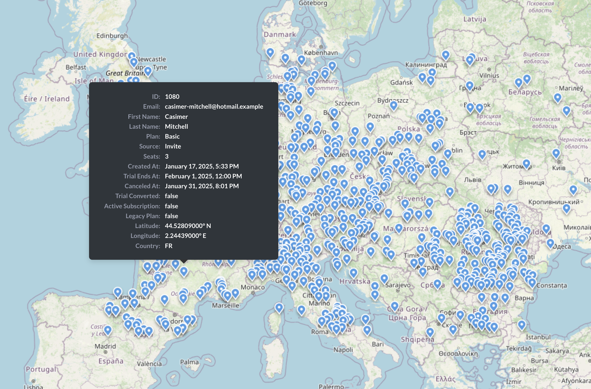
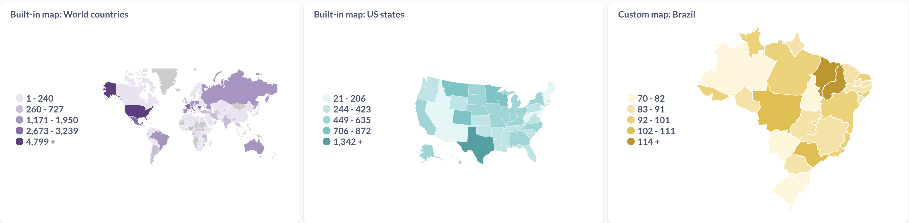
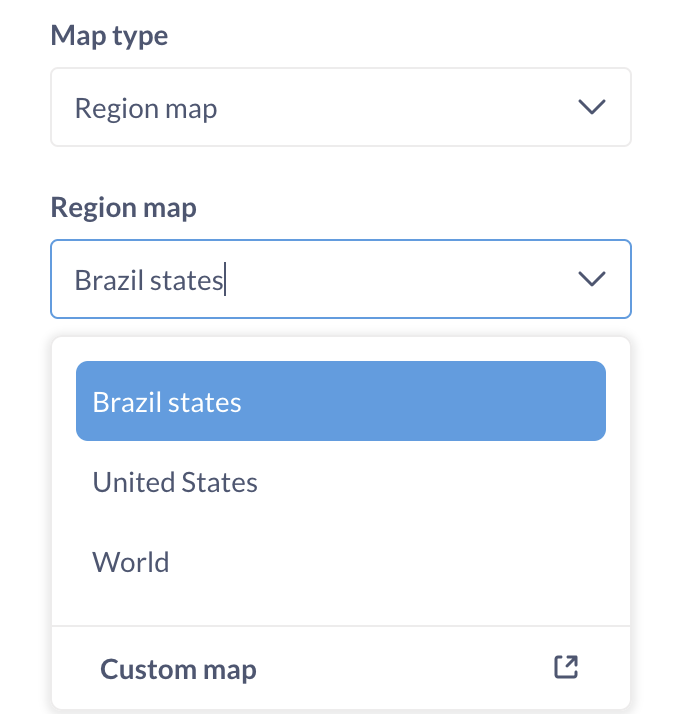
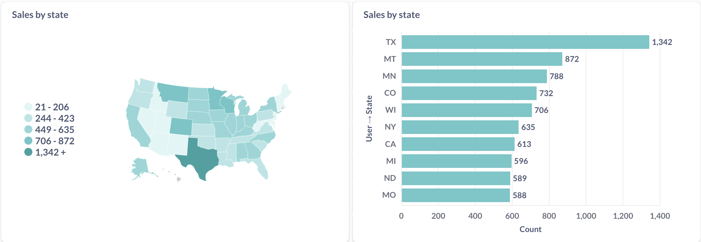

# Karten
Metabase bietet drei Arten der Kartenvisualisierung:
- [**Pinmap**](#pin-map) zur Darstellung einzelner Datenpunkte auf einer Karte unter Verwendung von Längen- und Breitenkoordinaten;
- [**Grid map**](#grid-map) für die Verteilung einer großen Anzahl von Punkten über ein bestimmtes Gebiet.
- [**Regionskarte**](#region-maps) für Daten, die nach Regionen, wie Ländern oder Staaten, aufgeteilt sind. Metabase wird mit zwei eingebauten Karten geliefert, Sie können aber auch Ihre eigenen Regionen hochladen.
Wenn Sie die Visualisierungseinstellung **Karte** wählen, versucht Metabase automatisch, die beste Art von Karte auf der Grundlage der Tabelle oder des Ergebnissatzes auszuwählen, sofern die Spalten mit den geografischen Daten die [richtigen Metadaten](../../data-modeling/metadata-editing.md) aufweisen.



## Pin-Karte
Pin-Karten zeigen Pins für einzelne Datenpunkte auf der Karte an. Sie eignen sich am besten für die Anzeige unaggregierter geografischer Daten.

### Form der Landkartendaten
Um eine Pin-Map zu erstellen, benötigen Sie eine Abfrage, die ein Ergebnis mit Breiten- und Längengradspalten liefert. Metabase setzt für jede Zeile in Ihrer Tabelle eine Stecknadel auf der Karte, basierend auf den Feldern für Breiten- und Längengrad. Andere Daten in den Zeilen werden in der QuickInfo angezeigt und haben ansonsten keinen Einfluss auf die Platzierung oder Form der Stecknadeln.

Beachten Sie, dass die Tooltips nur angezeigt werden, wenn die Karte mit [**Draw box to filter**](#draw-box-to-filter) ausreichend vergrößert wurde.

### Erstellen einer Pin-Karte
So erstellen Sie eine Pin-Karte:
1. Erstellen Sie eine Abfrage mit Breiten- und Längengradspalten für jeden Datenpunkt (entweder im Query Builder oder mit SQL);
2. Wählen Sie **Visualisierung**, und wählen Sie **Karte**;
3. Wenn Ihre Abfrageergebnisse Spalten enthalten, deren Feldtyp in [table metadata] (../../data-modeling/metadata-editing.md#field-type) auf Breitengrad/Längengrad eingestellt ist, sollte Metabase automatisch eine Pin Map erstellen.
   Andernfalls klicken Sie auf das Symbol **Gear**, um zu den Visualisierungseinstellungen zu gelangen, und wählen Sie **Map type: Pin Map** und wählen Sie Spalten aus, die Breiten- und Längengradkoordinaten enthalten.

### Pin Maps zeigen standardmäßig 2000 Pins an
Standardmäßig werden bei Pin Maps 2000 Pins angezeigt, auch wenn die Abfrageergebnisse mehr Zeilen enthalten (diese Grenze gilt für alle Diagramme, die unaggregierte Daten in der Metabase anzeigen). Sie können die Umgebungsvariable [`MB_UNAGGREGATED_QUERY_ROW_LIMIT`] (../../configuring-metabase/environment-variables.md#mb_unaggregated_query_row_limit) verwenden, um die Anzahl der Datenpunkte zu erhöhen, die in Diagrammen auf der Basis von nicht aggregierten Abfragen angezeigt werden. Beachten Sie jedoch, dass diese Einstellung alle Diagramme - nicht nur die Pin-Maps - beeinflusst und die Metabase und den Browser erheblich verlangsamen kann.
Wenn Sie eine große Anzahl von geografischen Datenpunkten anzeigen müssen, sollten Sie stattdessen eine Rasterkarte zur Darstellung der Verteilung verwenden.

## Rasterkarte
Die Rasterkarte ist eine aggregierte Version der Stecknadelkarte - wie eine Heatmap für die Verteilung von Stecknadeln. Die Rasterkarte unterteilt die Karte in ein Raster, das auf Breiten- und Längengraden basiert, und färbt dann jede Rasterzelle ein, je nachdem, wie viele Datenpunkte in sie fallen.

### Grid map data shape
Um eine Rasterkarte zu erstellen, benötigen Sie eine Abfrage, die eine Metrik zurückgibt, die durch gebündelte Breiten-/Längenkoordinaten zusammengefasst ist.
Beispiel für Daten für eine Rasterkarte](../images/latlong-binned-result.png)
Wenn Sie eine Abfrage im Abfragegenerator schreiben, können Sie im Block **Gruppieren nach** auswählen, wie die Breiten-/Längengrade zusammengefasst werden sollen. Wenn Sie eine Abfrage in SQL schreiben, müssen Sie die Einteilungslogik selbst hinzufügen.
Binned latitude and longitude in the query builder](../images/bin-by-latlong.png)

### Erstellen einer Rasterkarte
So erstellen Sie eine Rasterkarte:
1. Erstellen Sie eine Abfrage mit einer Zusammenfassung nach Längen- und Breitengraden (entweder im Query Builder oder mit SQL);
2. Wählen Sie **Visualisierung**, und wählen Sie **Karte**;
3. Wenn Ihre Abfrageergebnisse Spalten enthalten, deren Feldtyp in [table metadata] (../../data-modeling/metadata-editing.md#field-type) auf Breitengrad/Längengrad eingestellt ist, sollte Metabase automatisch eine Gitterkarte erstellen.
   Andernfalls klicken Sie auf das Symbol **Gear**, um zu den Visualisierungseinstellungen zu gelangen, wählen Sie **Map type: grid map** und wählen Sie Spalten aus, die Breiten- und Längengradkoordinaten enthalten.
4. Wenn Ihre Abfrage mehrere Metriken enthält, können Sie in den Visualisierungseinstellungen diejenige auswählen, die Sie anzeigen möchten.

## Regionale Karten
Regionale Maps zeigen eine nach Regionen aufgeschlüsselte Verteilung der aggregierten Daten an, z. B. die Anzahl der Nutzer nach Land.
Metabase verfügt über zwei eingebaute Regionen: [world map](#world-map) mit Ländern und die [Unites States map](#united-states-map) mit Staaten. Admins können in den Admin-Einstellungen [benutzerdefinierte Regionen](#custom-regions) hinzufügen.

Sie können die Standardregionen deaktivieren, indem Sie die Umgebungsvariable [`MB_DEFAULT_MAPS_ENABLED`] (../../configuring-metabase/environment-variables.md#mb_default_maps_enabled) setzen.

### Form der Regionenkartendaten
Um eine Regionenkarte zu erstellen, benötigen Sie eine Abfrage (entweder eine mit dem Abfragegenerator erstellte Frage oder eine systemeigene Abfrage) mit mindestens zwei Spalten: die Spalte mit dem Namen der Region und die Spalte mit der Metrik, die Sie nach Region anzeigen möchten.
Beispiel für eine Abfrage nach Region](../images/region-map-query.png)
Der Regionsname in den Abfrageergebnissen muss unter Berücksichtigung der Groß- und Kleinschreibung genau mit dem Regionsnamen übereinstimmen: ein aus zwei Buchstaben bestehender Ländercode für Weltkarten, ein aus zwei Buchstaben bestehender Bundesstaatencode oder der Name des Bundesstaates für die Karte der Vereinigten Staaten oder der [region identifier](../../configuring-metabase/custom-maps.md) in der benutzerdefinierten Region.
Um eine Regionskarte zu erstellen, müssen Sie eine Spalte mit einem Regionsnamen in Ihren Abfrageergebnissen haben, auch wenn Ihre Abfrageergebnisse auch Breiten-/Längenkoordinaten enthalten. Metabase kann keine Regionen aus Breiten-/Längenkoordinaten ableiten und prüft nicht, ob die Koordinaten eines Datenpunkts mit der Region für diesen Datenpunkt übereinstimmen.

### Erstellen Sie eine Regionenkarte
So erstellen Sie eine Regionenkarte:
1. Erstellen Sie eine Abfrage mit einer Zusammenfassung nach Regionsnamen (entweder im Query Builder oder mit SQL).
2. Wählen Sie **Visualisierung**, und wählen Sie **Karte**;
3. Wählen Sie **Kartentyp: Region**;
4. Wählen Sie die Karte der Region: Weltkarte (integriert), Vereinigte Staaten (integriert), oder
5. Wählen Sie die Spalte mit dem Namen der Region im Feld **Region**.
6. Wenn Ihre Abfrage mehrere Metriken enthält, können Sie im Feld **Metrik** diejenige auswählen, die Sie anzeigen möchten.
Sie können die für die Regionskarte verwendete Grundfarbe ändern, aber Sie können derzeit keine benutzerdefinierten Farbverläufe (z. B. von rot nach grün) verwenden oder ändern, wie Metabase die Metrik aufteilt.

### Weltkarte
Um Ihre Ergebnisse im Format einer nach Ländern gegliederten Weltkarte darzustellen, muss Ihr Ergebnis eine Spalte mit [zweibuchstabigen ISO-Ländercodes] (https://www.metabase.com/glossary/country-code) enthalten, z. B. "US" oder "BR":
| Ländercode | Metrisch |
| ------------ | ------ |
| US | 36 |
| BR | 25 |
| IN | 62 |
| RO | 78 |
Die Ländercodes in den Abfrageergebnissen müssen genau mit den zweistelligen Codes übereinstimmen: Wenn die Ländercodes klein geschrieben sind oder zusätzliche Leerzeichen enthalten, werden sie von Metabase nicht erkannt.
Wenn Ihr Abfrageergebnis Spalten mit dem [semantischen Typ](../../data-modeling/metadata-editing.md#field-type) "Land" enthält, sollte Metabase automatisch eine Weltkarte erstellen. Andernfalls können Sie in der Visualisierungseinstellung **Regionsfeld** auswählen, welche Spalten als Ländername verwendet werden sollen.
Sie können die Länderspalte in der Weltregionskarte mit einem Dashboard-Filter vom Typ "Ort" verbinden.

### Karte der Vereinigten Staaten
Um aus Ihren Daten eine Karte der Vereinigten Staaten zu erstellen, müssen Ihre Ergebnisse eine Spalte enthalten, die Namen von Bundesstaaten oder zweistellige Bundesstaatencodes enthält, zum Beispiel "NM" oder "New Mexico":
| State | Metric |
| ---------- | ------ |
| Kalifornien | 45 |
| New York | 56 |
| Texas | 34 |
| Illinois | 67 |
Wenn Ihr Abfrageergebnis Spalten mit dem [semantischen Typ](../../data-modeling/metadata-editing.md#field-type) "State" enthält, sollte Metabase automatisch eine US-Karte erstellen. Andernfalls können Sie in den Visualisierungseinstellungen auswählen, welche Spalten als Ländernamen verwendet werden sollen.
Sie können die State-Spalte in der US-Regionalkarte mit einem Dashboard-Filter vom Typ "Location" verbinden.

### Benutzerdefinierte Regionen
Admins können weitere Regionen - wie die brasilianischen Bundesstaaten oder die Stadtteile von New York - hinzufügen, indem sie in den **Admin-Einstellungen** benutzerdefinierte GeoJSON-Karten hinzufügen (../../configuring-metabase/custom-maps.md). Sobald Sie benutzerdefinierte Karten hinzugefügt haben, können Sie diese bei der Erstellung einer Regionskarte in den Karteneinstellungen auswählen.

Ihre Abfrageergebnisse müssen eine Spalte mit Werten enthalten, die mit der Eigenschaft _region identifier_ in der benutzerdefinierten Karteneinstellung übereinstimmen (nicht mit dem Anzeigenamen der Region).
Wenn Sie die Regionenspalte in einer benutzerdefinierten Regionenkarte mit einem Dashboard-Filter verbinden möchten, müssen Sie einen Dashboard-Filtertyp "Text oder Kategorie" - nicht "Ort" - verwenden.

## Arbeiten mit Karten

### Drill-through
- **Pin-Karte**: Wenn die Stecknadel mit anderen Tabellen verknüpft ist oder zu viele Informationen enthält, die nicht in den Tooltip passen, gelangen Sie durch Klicken auf die Stecknadel zu einer Detailseite, die eine Liste der Felder sowie eine Liste der verknüpften Tabellen anzeigt.
- **Gitterkarte**: Wenn Sie auf eine Rasterzelle klicken, erhalten Sie die Möglichkeit, weiter in die Zelle hineinzuzoomen.
- **Weltkarte und Karten der US-Bundesstaaten**: Wenn Ihre unaggregierten Daten zusätzlich zum Regionsnamen auch die Koordinaten der Breiten- und Längengrade für jeden Datenpunkt enthalten, erhalten Sie die Möglichkeit, in eine bestimmte Region zu zoomen. Dies gilt nur für die integrierten Regionalkarten, nicht für benutzerdefinierte Regionalkarten.

### Als Standardansicht festlegen
Bei Pin- und Rasterkarten wird die Karte bei jedem Aktualisieren der Seite auf die Standardansicht zurückgesetzt. Um zu steuern, was angezeigt wird, wenn jemand eine Karte öffnet (z. B. um einen bestimmten Punkt zentriert, mit einer bestimmten Zoomstufe), passen Sie Ihre Kartenausrichtung an. Dies wird die neue Standardansicht sein, zu der die Karte nach einer Aktualisierung der Seite zurückkehrt.

### Kästchen zum Filtern einzeichnen
Auf Pin- und Rasterkarten können Sie mit Hilfe von Filterboxen die Daten vergrößern oder nach einem bestimmten Bereich filtern.
Klicken Sie auf **Kasten zum Filtern zeichnen** und fahren Sie mit der Maus über die Karte. Um einen Kartenausschnitt zu umreißen, halten Sie die Maus gedrückt und ziehen Sie über die Karte, um einen transparenten blauen Rahmen zu erstellen. Sobald Sie Ihren Zielbereich umrissen haben, lassen Sie die Maus los, und die Karte wird aktualisiert, um nach Daten im ausgewählten Bereich zu filtern. Wenn Sie eine Standardansicht festgelegt haben, bleibt die Ansicht stationär. Wenn Sie keine Standardansicht festgelegt haben, wird die Ansicht auf den ausgewählten Bereich gezoomt.
Wenn Sie ein Feld zeichnen, werden Ihrer Abfrage Filter hinzugefügt.

## Anpassen der Kartenkacheln
Admins können die Hintergrundkacheln, die für Pin- und Rasterkarten verwendet werden, anpassen, siehe [Ändern des Kartenkachel-Servers](../../configuring-metabase/custom-maps.md#map-tile-server).

Derzeit verwendet Metabase einen einzigen Kachelserver pro Instanz. Es ist nicht möglich, verschiedene Kacheln für verschiedene Karten anzugeben.

## Beschränkungen
- Derzeit können Sie die folgenden Visualisierungseinstellungen auf Karten nicht anpassen:
  - Die Farbe der Pins auf einer Pin-Karte;
- Die Farbe der Bins auf der Rasterkarte;
- Die Anzahl und Größe der Bins für Gebietskarten.
- Sie können keine verschiedenen Kartentypen kombinieren. Sie können zum Beispiel keine Stecknadeln in eine Regionskarte einfügen.
- Wenn Sie benutzerdefinierte Regionskarten mit Dashboard-Filtern verbinden, müssen Sie Dashboard-Filtertypen für Kategorien (nicht für Standorte) verwenden.
- Sie können keine unterschiedlichen Hintergrundkacheln für verschiedene Karten festlegen.

## Wann sollte man keine Karte zur Visualisierung von geografischen Daten verwenden?
Wenn die relative Lage der Regionen auf der Karte nicht der Hauptschwerpunkt Ihrer Visualisierung ist, sollten Sie stattdessen ein Balken- oder Zeilendiagramm verwenden. So lassen sich beispielsweise die Umsätze nach Bundesland oft besser in einem Zeilen- oder Balkendiagramm als in einer Regionalkarte darstellen.

