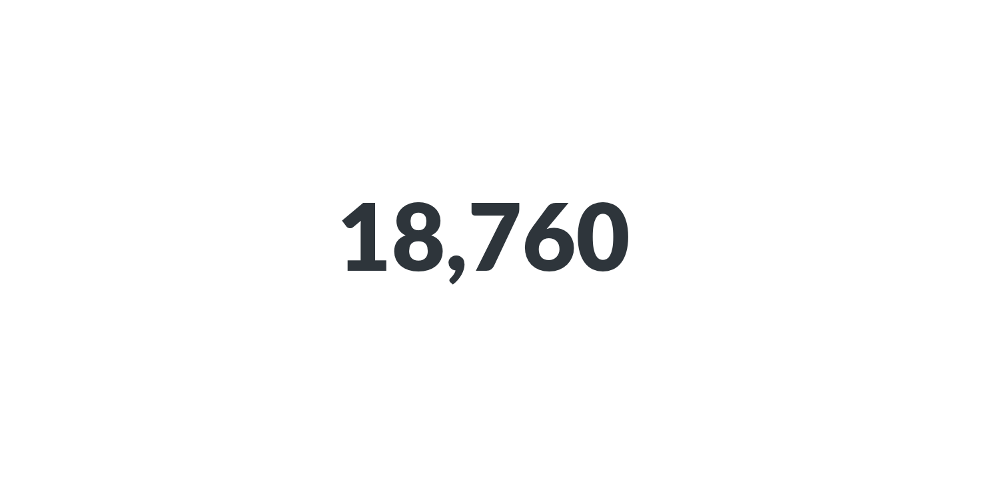

#Zahlen
Mit der Option **Zahlen** können Sie eine einzelne Zahl schön groß anzeigen lassen. Die Optionen für Zahlen umfassen:

- **Hinzufügen von Zeichenpräfixen oder -suffixen** (um z. B. ein Währungssymbol voranzustellen oder ein Prozentzeichen an das Ende zu setzen),
- **Einstellen der Anzahl der Dezimalstellen**, die einbezogen werden sollen, und
- **Multiplizieren des Ergebnisses mit einer Zahl** (z. B. wenn Sie eine Dezimalzahl mit 100 multiplizieren möchten, damit sie wie ein Prozentwert aussieht). Wenn Sie mit einer Zahl _dividieren_ wollen, dann multiplizieren Sie sie einfach mit einer Dezimalzahl (z. B. wenn Ihr Ergebnis `100` ist, aber als `1` angezeigt werden soll, multiplizieren Sie es einfach mit 0,01).
