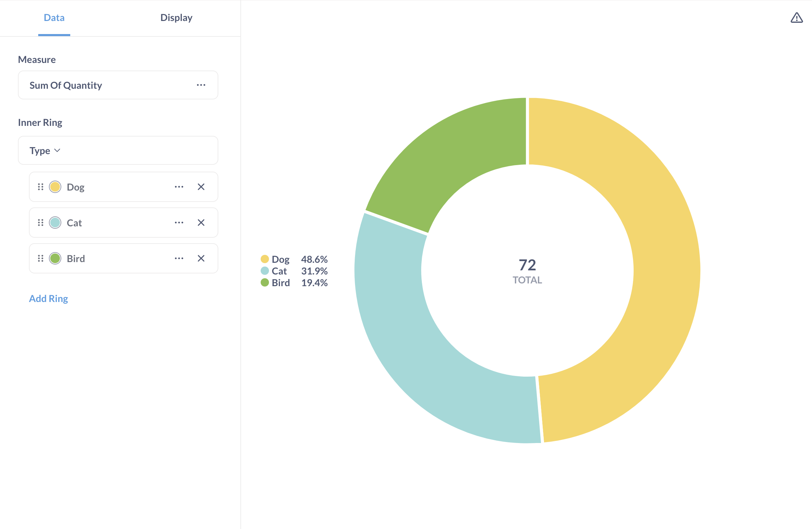
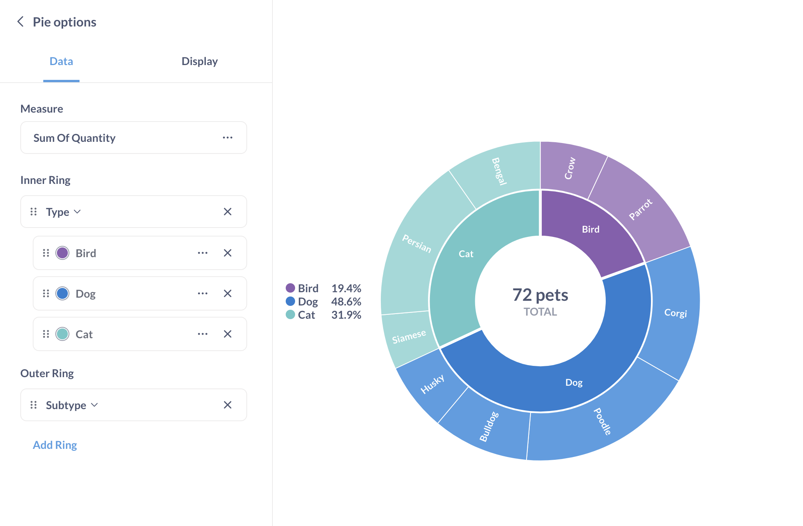
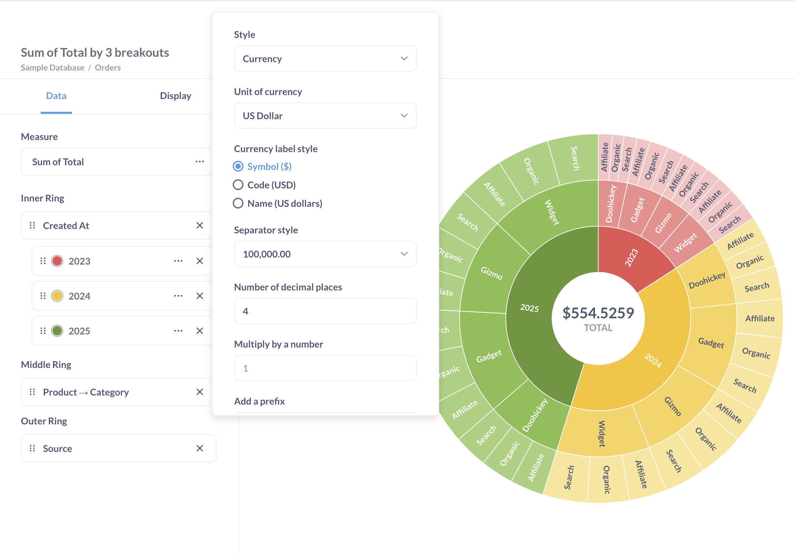
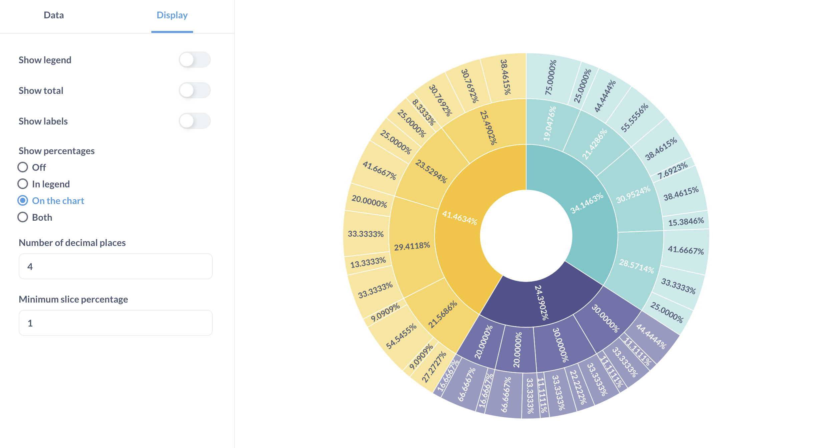
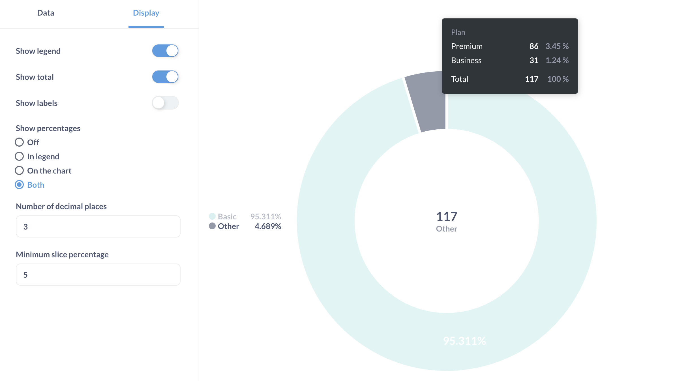

# Tortendiagramm und Sunburst-Diagramm
Ein **Kuchendiagramm** kann verwendet werden, um eine Metrik nach einer einzelnen Dimension aufzuschlüsseln. In Metabase sind Torten Donuts. Ein **Sunburst-Diagramm** ist ein mehrdimensionales Kreisdiagramm mit mehreren Unterteilungen.
Torten- und Sunburst-Diagramme](../images/pie-sunburst-demo.png)

## Wann wird ein Torten- oder Sunburst-Diagramm verwendet?
Kreisdiagramme können verwendet werden, um eine Metrik als Teil eines Ganzen zu visualisieren. Sunburst-Diagramme können verwendet werden, um hierarchische oder verschachtelte Daten zu visualisieren oder um mehrere Ebenen der Kategorisierung anzuzeigen.
Tortendiagramme und Sunburst-Diagramme eignen sich am besten, wenn die Anzahl der möglichen Untergliederungswerte gering ist, wie z. B. Konten nach Plan. Diese Diagramme sollten nur zur Darstellung von Metriken verwendet werden, die sich zu 100 % addieren (z. B. Anzahl oder Gesamtsumme).
Kreisdiagramme sollten verwendet werden, um ein allgemeines Gefühl für die relative Größe von Ausbrüchen zu vermitteln. Wenn ein präziser Vergleich wichtig ist, um die genauen Unterschiede zwischen den Werten zu erkennen, oder wenn Sie mehr als ein paar Unterteilungen haben (z. B. Kunden pro Land), ist es normalerweise besser, ein Balken- oder Zeilendiagramm zu verwenden.

## Wie erstellt man ein Torten- oder Sunburst-Diagramm?
Torten- und Sunburst-Diagramme zeigen eine einzelne Kennzahl in einer oder mehreren Unterteilungen an. Sowohl Torten-/Donut-Diagramme als auch Sunburst-Diagramme sind in der Option "Tortendiagramm" in der Seitenleiste der Visualisierung verfügbar.
Für ein einfaches Kreisdiagramm benötigen Sie eine Abfrage mit einer einzelnen Untergliederung und einer Metrik, z. B.:
| Typ | Summe der Menge |
| ---- | --------------- |
| Katze | 23 |
| Vogel | 14 |
| Hund | 35 |
Wenn Ihre Abfrage mehrere Metriken hat, können Sie die Metrik für das Diagramm in [Diagrammeinstellungen](#pie-and-sunburst-chart-settings) auswählen.

Für ein Sunburst-Diagramm (mehrdimensionales Kreisdiagramm) benötigen Sie eine Abfrage mit bis zu drei Unterteilungen und einer numerischen Metrik. Hier ist ein Beispiel für ein Abfrageergebnis mit zwei Untergliederungen, "Typ" und "Untertyp":
| Typ | Untertyp | Summe der Menge |
| ---- | ------- | --------------- |
| Katze | Siamesisch | 4 |
| Katze | Perser | 12 |
| Katze | Bengalisch | 7 |
| Vogel | Krähe | 5 |
| Vogel | Papagei | 9 |
| Hund | Corgi | 10 |
| Hund | Pudel | 13 |
| Hund | Bulldogge | 7 |
| Hund | Husky | 5 |
Sie können in den [Diagramm-"Daten"-Einstellungen](#data-settings) auswählen, welche Ausbrüche den inneren, mittleren oder äußeren Ringen des Sunburst-Diagramms zugewiesen werden sollen. Wenn Ihre Abfrage mehrere Metriken enthält, können Sie auch auswählen, welche Metrik angezeigt werden soll. Hier ist das Sunburst-Diagramm für die obige Beispieltabelle:

Sie müssen die Prozentsätze nicht in Ihre Abfrage aufnehmen. Metabase berechnet automatisch den prozentualen Anteil an der Gesamtzahl für jeden Wert der Metrik (z. B. errechnet Metabase, dass 23 Katzen 31,9 % aller Haustiere ausmachen).

## Einstellungen für Torten- und Sunburst-Diagramme
Um die Diagrammoptionen zu öffnen, klicken Sie auf das Zahnradsymbol unten links auf dem Bildschirm. Daraufhin öffnet sich eine Einstellungs-Seitenleiste mit den Registerkarten **Daten** und **Anzeige**.

### Dateneinstellungen
Sie können Scheiben aus dem inneren Ring eines Sunburst- oder Kreisdiagramms umbenennen, neu anordnen oder entfernen. Um die Tortenscheiben neu anzuordnen, ziehen Sie die Karten mit den Scheibennamen. Um die Slices umzubenennen, klicken Sie auf die drei Punkte neben dem Namen der Serie und geben Sie einen neuen Namen ein.
Um die Farbe der Tortenstücke zu ändern, klicken Sie auf den Farbkreis neben dem Namen des Stücks. In Sunburst-Diagrammen können Sie nur die Farbe der Slices im _inneren_ Ring ändern (die Slices in den äußeren Ringen erben die Farben ihrer übergeordneten Slices).
Wenn Ihre Abfrage mehrere Metriken (Spalten) hat, können Sie die Spalte, die im Diagramm dargestellt werden soll, im Dropdown-Menü **Maßnahme** auswählen.
Um die in der Mitte des Diagramms angezeigte Gesamtsumme zu formatieren, klicken Sie auf die drei Punkte neben dem Namen der Metrik in der Einstellung **Maßnahme**. Die Optionen für das Messgrößenformat - einschließlich der Option "Anzahl der Dezimalstellen" - gelten nur für die Gesamtsumme und nicht für die Prozentwerte oder Beschriftungen. Um die Anzeige der Prozentwerte und Beschriftungen zu konfigurieren, gehen Sie auf die Registerkarte [Anzeigeeinstellungen](#display-settings).

### Anzeigeeinstellungen
Sie können einstellen, ob angezeigt werden soll:
- Die Legende neben dem Diagramm.
- Die Gesamtsumme in der Mitte des Diagramms. Das Format der Gesamtsumme kann in den [Dateneinstellungen](#data-settings) geändert werden.
- Die Beschriftungen für die Tortenscheiben. Die Beschriftung der inneren Ringscheiben kann in den [Dateneinstellungen](#data-settings) geändert werden.
  Bei Sunburst-Diagrammen mit mehreren Ausbrüchen wird nur der innere Ringausbruch in der Legende angezeigt. Standardmäßig ist die Funktion "Beschriftungen anzeigen" aktiviert. Wenn Sie "Beschriftungen anzeigen" deaktivieren, können Sie die Slices in einem Sunburst-Diagramm nur unterscheiden, indem Sie mit dem Mauszeiger über sie fahren.
- Die Prozentwerte für die Slices. Wenn Sie sich für die Anzeige von Prozentwerten **in der Legende** entscheiden, dann aber die Option **Legende anzeigen** deaktivieren, werden die Prozentwerte nicht im Diagramm angezeigt.
  Sie können die Prozentwerte für jeden Slice immer sehen, indem Sie den Mauszeiger über den Slice bewegen.
Um die Anzahl der Dezimalstellen in den Prozentwerten zu ändern, verwenden Sie die Einstellung **Anzahl der Dezimalstellen** auf der Registerkarte **Anzeige**. Wenn Sie die Anzahl der Dezimalstellen für die Gesamtsumme in der Mitte des Diagramms ändern möchten, gehen Sie zu [Dateneinstellungen](#data-settings).

Um das Diagramm besser lesbar zu machen, können Sie Slices, die kleiner als ein bestimmter Prozentsatz sind, zu einem Slice zusammenfassen, indem Sie **Minimum slice percentage** einstellen. Sie können die Kategorien und Werte im **Sonstigen** Slice sehen, wenn Sie den Mauszeiger über dieses Slice bewegen:

Derzeit können Sie weder die Farbe noch die Bezeichnung der **Anderen** Scheibe ändern.

## Beschränkungen und Alternativen
Ziehen Sie in den folgenden Fällen die Verwendung eines Balken- oder Zeilendiagramms (oder eines [gestapelten Balkendiagramms](line-bar-and-area-charts.md#stacked-bar-chart)) oder einer [Pivot-Tabelle](pivot-table.md) anstelle eines Torten- oder Sunburst-Diagramms in Betracht:
- Ihre Daten haben mehr als drei Unterteilungen
- Ihre Metriken ergeben nicht 100 % (z. B. durchschnittliche Bewertung - in diesem Fall ist ein Balkendiagramm vorzuziehen)
- Sie haben viele Kategorien in jeder Untergliederung
