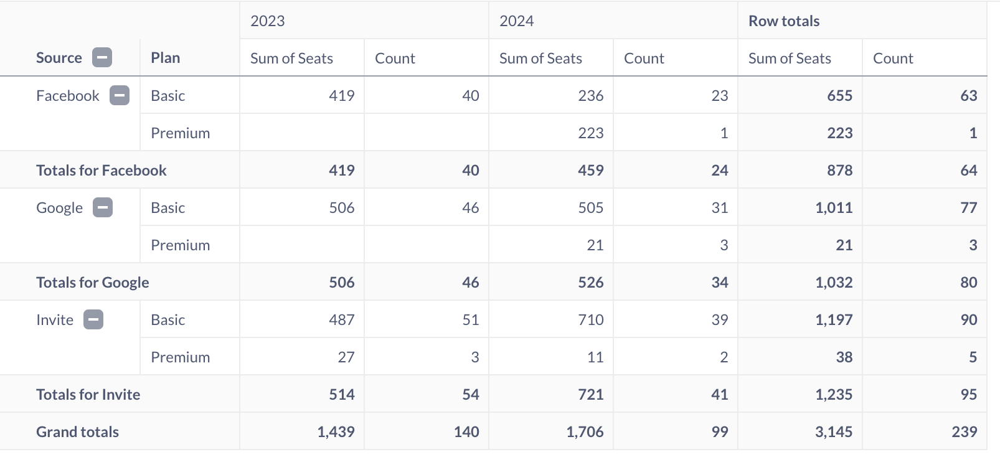
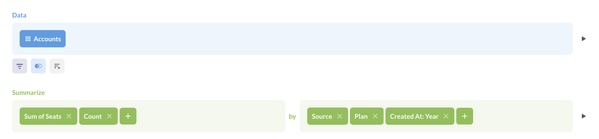
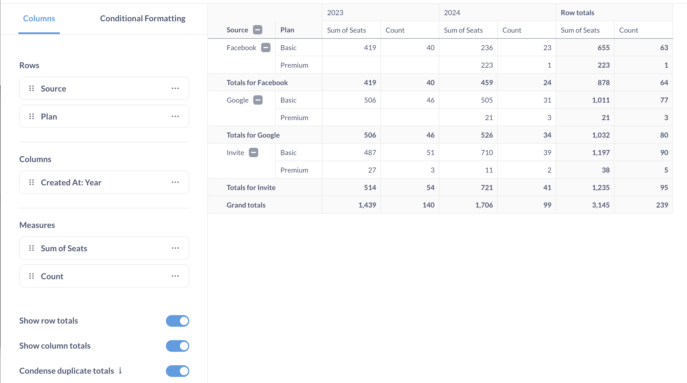
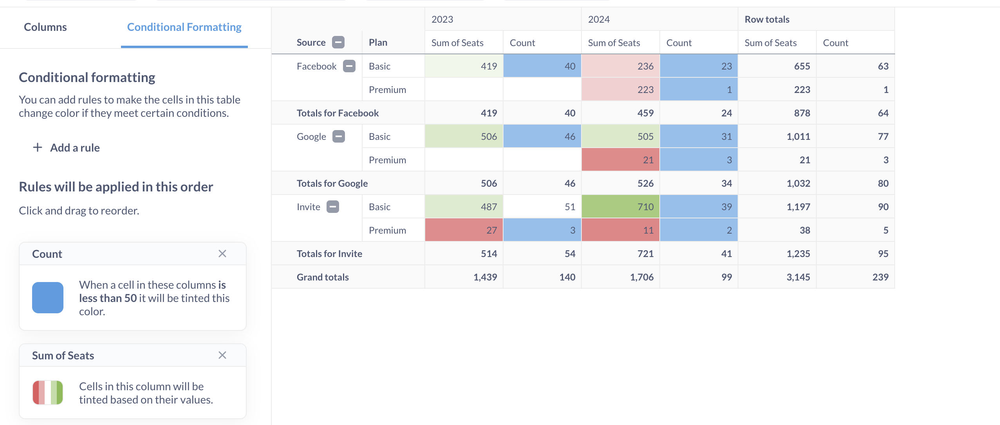
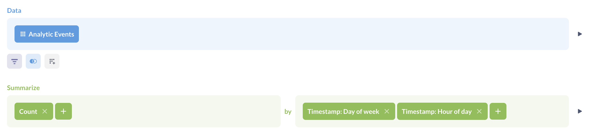
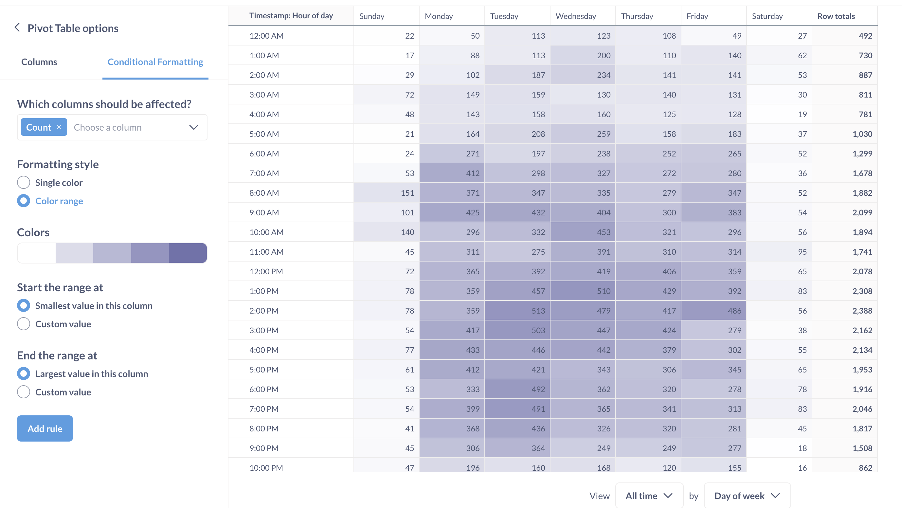

# Pivot-Tabellen
> Pivot-Tabellen werden derzeit nur für Fragen unterstützt, die mit dem [query builder] (../query-builder/editor.md) erstellt wurden. Pivot-Tabellen werden nicht für NoSQL-Datenbanken wie MongoDB unterstützt.
Mit Pivot-Tabellen können Sie Zeilen und Spalten vertauschen, Daten gruppieren und Zwischensummen in Ihre Tabelle aufnehmen. Sie können eine oder mehrere Metriken nach einer oder mehreren Dimensionen gruppieren.


## Pivot-Tabellen vs. normale Tabellen
Die typische, einfache Tabelle ist ein Gitter aus Zellen. Jede Dimension (auch bekannt als Attribut, "gruppieren nach") wird durch eine Spalte dargestellt. Jeder Datensatz wird als eine Zeile dargestellt. In der folgenden Tabelle sind beispielsweise "Quelle", "Plan" und "Erstellt am" Dimensionen/Attribute für die metrischen Werte "Summe der Sitze" und "Anzahl":

Eine Pivot-Tabelle ist eine Tabelle, die sowohl in Zeilen als auch in Spalten Dimensionen und in den Zellen metrische Werte hat. Pivot-Tabellen können Zusammenfassungszeilen mit Gesamtwerten für diese Dimensionen enthalten:

Pivot-Tabellen werden deshalb so genannt, weil Sie eine Spalte um 90 Grad drehen können, so dass die Werte in dieser Spalte selbst zu Spaltenüberschriften werden. Das Pivotieren von Werten in Spaltenüberschriften ist nützlich, wenn Sie Daten über mehrere Attribute hinweg analysieren, z. B. Zeit, Ort und Kategorie. Sie können mehrere Zeilen in Spalten umwandeln und umgekehrt, oder auch gar keine Umwandlung vornehmen.
Die Pivot-Tabelle ist der einzige Metabase-Visualisierungstyp (neben der einfachen Tabelle natürlich), der mehrere Metriken gleichzeitig entlang mehrerer Dimensionen anzeigen kann.

## Wie man eine Pivot-Tabelle erstellt
Um eine Pivot-Tabelle zu erstellen, müssen Sie den Query Builder verwenden. Derzeit können Sie keine Pivot-Tabellen für Fragen erstellen, die in SQL geschrieben wurden, da Metabase Ihren SQL-Code ändern müsste, um Zwischensummen zu berechnen. Wenn Sie wirklich SQL verwenden müssen, besteht die Lösung darin, Ihre Frage in zwei Schritten zu erstellen: Führen Sie zunächst alle komplexen Aufgaben in SQL aus, speichern Sie die Ergebnisse als Frage und verwenden Sie dann diese gespeicherte SQL-Frage als Ausgangspunkt für eine neue Query Builder-Frage, die diese Daten zusammenfasst.
1. Erstellen Sie eine Frage im Query Builder, die eine Zusammenfassung mit mindestens einer Untergliederung enthält, zum Beispiel "Anzahl der Bestellungen nach Kategorie und Monat".
   Sie können mehrere Metriken in der Abfrage haben (z. B. "`Anzahl` _und `Durchschnitt der Summe` der Bestellungen_ nach `Kategorie` und `Monat`")
   
2. Klicken Sie auf **Visualisieren**.
3. Um die Visualisierung in die Pivot-Tabelle zu ändern, klicken Sie auf das Symbol **Visualisierung** unten links und wählen Sie **Pivot-Tabelle** in der Seitenleiste.
4. Um Felder zu konfigurieren, die als Zeilen und Spalten in der Pivot-Tabelle angezeigt werden, klicken Sie auf das Symbol **Zahnrad**, und ordnen Sie Felder einem der drei "Bereiche" zu: **Zeilen**, **Spalten** oder **Maße**.
   - **Zeilen** und **Spalten** sollten die Dimensionen oder Unterteilungen enthalten - mit anderen Worten, die Felder, nach denen Sie gruppieren, z. B. "Kategorie" oder "Erzeugt am".
- Die **Maße** sollten Ihre Zusammenfassungen oder Metriken enthalten - Dinge wie "Anzahl" oder "Durchschnitt der Summe".
   Optionen für die Pivot-Tabelle](../images/pivot-table-options.png)
   Sie können mehrere Felder in die "Zeilen"- und "Spalten"-Bereiche einfügen, aber beachten Sie, dass die Reihenfolge der Felder die Anzeige der Tabelle in Metabase verändert: Jedes zusätzliche Feld wird in das vorherige Feld eingefügt.
Derzeit müssen alle Dimensionen und Metriken in Ihrer Abfrage entweder als Zeilen, Spalten oder Kennzahlen in der Pivot-Tabelle angezeigt werden (obwohl Sie Zeilen auf ihre Summen reduzieren können) (#totals-and-grand-totals). Wenn Sie einen Breakout oder eine Metrik nicht in der Pivot-Tabelle anzeigen möchten, müssen Sie diese aus der Abfrage entfernen - Sie können sie nicht aus der Pivot-Tabelle ausblenden.

## Summen und Gesamtsummen
Wo es sinnvoll ist, fügt Metabase automatisch Zwischensummen für gruppierte Zeilen hinzu.

Da wir unsere Zeilen zunächst nach "Quelle" und dann nach "Plan" gruppiert haben, listet Metabase beispielsweise, wie in der obigen Abbildung, jeden Plan für jede "Quelle" auf und aggregiert dann die Metrik(en) für diese Quelle.
Um eine Gruppe in einer Pivot-Tabelle zu verkleinern, klicken Sie auf die Minus-Schaltfläche (-) neben der Überschrift der Gruppe (oder auf die Plus-Schaltfläche (+), um sie zu vergrößern). Wenn Sie eine Pivot-Tabelle speichern, merkt sich Metabase, welche Gruppen erweitert und welche komprimiert wurden.
Sie können Metabase bitten, die Summen auszublenden, indem Sie in den Pivot-Tabelleneinstellungen (Symbol **Zahnrad**) die Option "Zeilen-/Spalten-Summen anzeigen" deaktivieren.

## Bedingte Formatierung in Pivot-Tabellen
Sie können Pivot-Tabellen auf der Grundlage von Bedingungen oder einer Reihe von Werten Farben hinzufügen:

Metabase formatiert keine Summen oder Gesamtsummen.
Die bedingte Formatierung von Pivot-Tabellen funktioniert genauso wie die von normalen Tabellen, siehe [Bedingte Formatierung](./table.md#conditional-table-formatting)

## Pivot-Tabellen als Heatmaps verwenden
Sie können bedingte Formatierungen in Pivot-Tabellen verwenden, um eine "Heatmap" von Werten nach Dimensionen zu erstellen:
1. Erstellen Sie eine Query Builder-Frage mit einem Zusammenfassungsblock, der Folgendes enthält:
- Eine Metrik, die die Intensität der Zellen in der Heatmap definiert
- Zwei Unterteilungen zur Definition der horizontalen und vertikalen Komponenten der Karte
2. Visualisieren Sie die Abfrage als Pivot-Tabelle.
3. Fügen Sie eine **"Farbbereich "** bedingte Formatierung hinzu.
Um z. B. eine Heatmap der stündlichen Aktivität nach Wochentag zu erstellen, verwenden Sie eine Abfrage mit Untergliederungen nach Tagesstunden und Wochentagen:

Verwenden Sie eine Pivot-Tabelle mit bedingter Formatierung:

## Pivot-Tabellen-Exporte
Beim Export von Pivot-Tabellen als XLSX-Dateien gibt es einige Besonderheiten zu beachten. Siehe [Exportieren von Pivot-Tabellen] (../exporting-results.md#exporting-pivot-tables).

## Einschränkungen der Pivot-Tabelle
- Pivot-Tabellen sind nur für SQL-Datenbanken verfügbar.
- Alle Metriken und Dimensionen, die in der Abfrage angegeben sind, werden in der Pivot-Tabelle angezeigt.
- Pivot-Tabellen sind nur für Fragen verfügbar, die mit dem Query Builder erstellt wurden.
- Die Query Builder-Frage muss einen Zusammenfassungsblock enthalten.
Wenn Sie SQL verwenden müssen und Ihre SQL-Abfrage keine Parameter hat, können Sie diese SQL-Abfrage speichern und dann ihre [Ergebnisse als Ausgangspunkt] (../native-editor/writing-sql.md#explore-sql-question-results-using-the-query-builder) für eine Query-Builder-Frage verwenden, um eine Frage zu erstellen. Der Trick dabei ist, dass Sie die Aggregation und Gruppierung im Query Builder vornehmen. Das heißt, verwenden Sie die SQL-Frage, um die Rohdaten zu erfassen, mit denen Sie arbeiten möchten (vielleicht [create a model](../../data-modeling/models.md)), und starten Sie dann eine neue Frage im Query Builder, um diese Daten zu filtern, zusammenzufassen und zu gruppieren.
