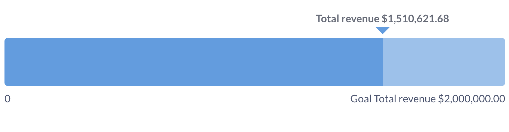
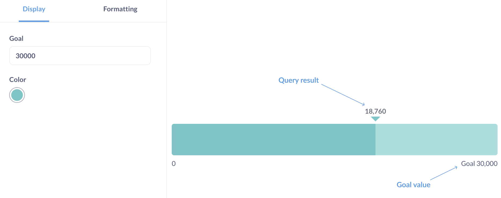
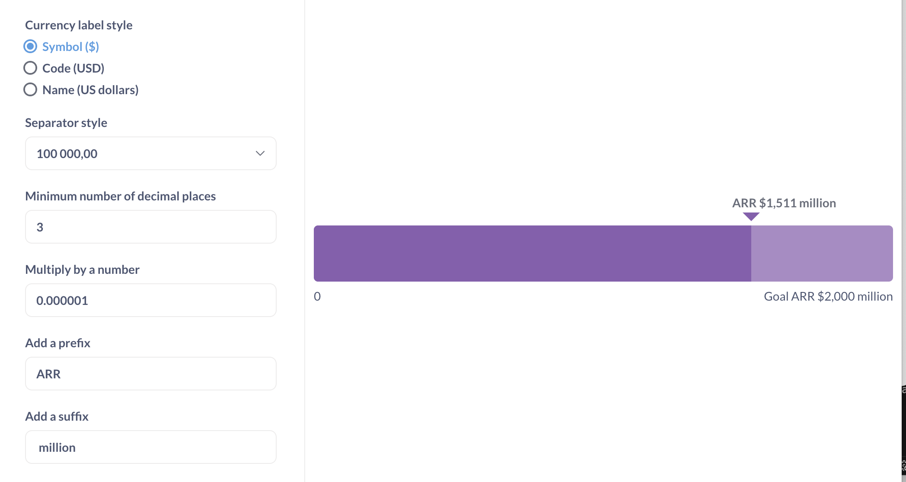

# Fortschrittsbalken
**Fortschrittsbalken** dienen dazu, eine einzelne Zahl mit einem von Ihnen festgelegten Zielwert zu vergleichen.

## Wann wird ein Fortschrittsbalken verwendet?
Fortschrittsbalken sind nützlich, wenn Sie die Entwicklung einer Kennzahl in Richtung eines Ziels anzeigen möchten, wie z. B. die Bewertung der Leistung eines KPI oder die Verfolgung des Prozentsatzes der Fertigstellung eines Projekts.
Fortschrittsbalken bieten Ihnen die Möglichkeit, eine Warnung einzurichten, wenn das Ergebnis einer Frage das in den Einstellungen des Fortschrittsbalkens festgelegte Ziel erreicht. Siehe [Fortschrittsbalken-Warnungen] (../alerts.md#progress-bar-alerts).

## Wie man einen Fortschrittsbalken erstellt
Um einen Fortschrittsbalken zu erstellen, benötigen Sie:
- Eine Abfrage, die eine einzelne Zahl zurückgibt, z. B. "Summe der Bestellmenge". Der Fortschrittsbalken funktioniert nicht mit Breakouts.
  Sie können auch eine Abfrage verwenden, die mehrere Metriken in einer einzigen Zeile zurückgibt:
  | Summe der Menge | Durchschnittliche Menge | Maximale Menge |
| --------------- | ---------------- | ------------ |
| 4910 | 17.32 | 173 |
In diesem Fall verwendet das Fortschrittsdiagramm die Kennzahl in der ersten Spalte ("Summe der Menge"). Um die Metrik zu ändern, gehen Sie zum Editor und ziehen Sie die gewünschte Metrik an die erste Position im Block "Zusammenfassen".
- Ein Zielwert. Der Zielwert sollte eine positive Zahl sein. Derzeit unterstützt Metabase nur das Festlegen eines statischen Ziels (Sie können kein Ziel basierend auf einer anderen Abfrage festlegen).
  Das Ziel wird in den [Diagrammoptionen](#progress-bar-options) festgelegt.

## Optionen für den Fortschrittsbalken
Um die Diagrammoptionen zu öffnen, klicken Sie auf das Zahnradsymbol unten links auf dem Bildschirm.
Die Formatierungsoptionen gelten sowohl für das Ergebnis der Abfrage als auch für den Zielwert:

Die Auswahl von "**Style**: Prozent" in den Formatierungsoptionen ändert nur, wie das Ergebnis der Abfrage formatiert wird: zum Beispiel wird "17" als "1700%" formatiert. Wenn Sie stattdessen das Abfrageergebnis als Prozentsatz des Ziels anzeigen möchten, müssen Sie diesen Prozentsatz in Ihrer Abfrage berechnen. Um zum Beispiel die Anzahl der Bestellungen als Prozentsatz des Ziels von `20` anzuzeigen, verwenden Sie [custom expressions](../query-builder/expressions.md), um "Anzahl der Bestellungen geteilt durch 20" zurückzugeben, und formatieren Sie das Ergebnis als Prozentsatz.

## Einschränkungen und Alternativen
- Bei den Fortschrittsbalken wird davon ausgegangen, dass Ihr Ziel darin besteht, eine Kennzahl zu _erhöhen_. Wenn das Ziel darin besteht, eine Kennzahl zu verringern oder zu reduzieren, sollten Sie das [gauge chart](gauge.md) verwenden.
- Fortschrittsbalken unterstützen keine Ausbrüche. Wenn Sie den Fortschritt einer Kennzahl in Richtung eines Ziels über einen Ausbruch anzeigen möchten, sollten Sie ein [Balken- oder Liniendiagramm mit einer Ziellinie](line-bar-and-area-charts.md#goal-lines) verwenden.

## Weitere Lektüre
- Balkendiagramme](./gauge.md)
- [Ziellinien in Balken- und Liniendiagrammen](./line-bar-and-area-charts.md#goal-lines)
- Tutorial: [Welches Diagramm soll ich verwenden?](https://www.metabase.com/learn/metabase-basics/querying-and-dashboards/visualization/chart-guide)
