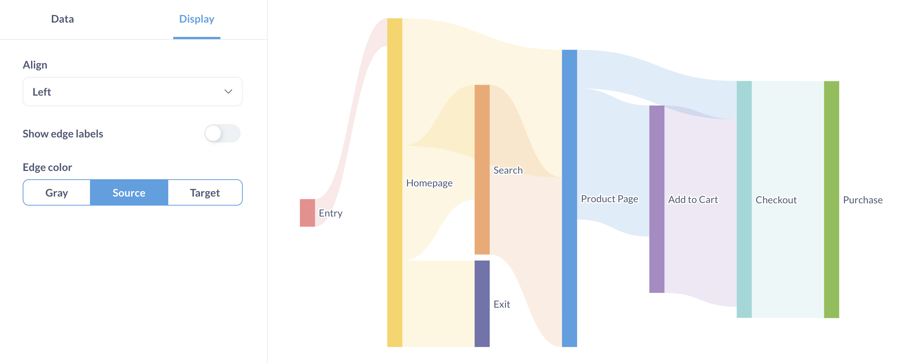
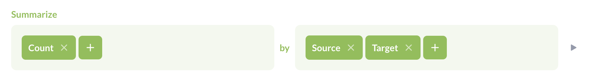
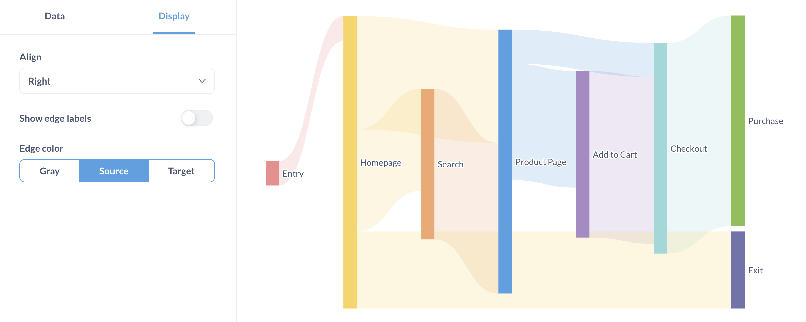
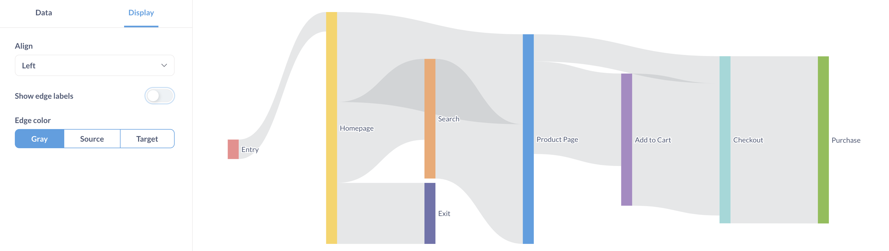

# Sankey-Diagramme
Sankey-Diagramme zeigen, wie Daten durch mehrdimensionale Schritte fließen. Sie sind nützlich, um zu zeigen, welche Elemente, Knoten genannt, zum Gesamtfluss beitragen.

## Sankey-Datenform
Um ein Sankey-Diagramm zu erstellen, benötigen Sie mindestens drei Spalten in Ihren Ergebnissen:
- **Quellenspalte**: gibt einen Knoten im Sankey-Fluss an.
- **Zielspalte**: gibt einen empfangenden Knoten an.
- Spalte **Zahl**: Wert, der die Dicke des Zielknotens bestimmt.
Wenn Sie rohe Seitenansichten hätten, bei denen jede Zeile eine Quellseite (z. B. den Titel einer Verweisseite) und eine Zielseite (z. B. den Titel der aktuellen Seitenansicht) enthielte, könnten Sie nach Anzahl zusammenfassen und nach der Quelle und dann nach dem Ziel gruppieren.

Hier ist die Datenform, die zur Erstellung des obigen Diagramms verwendet wurde.
| Quellseite | Zielseite | Besucher insgesamt |
| ------------ | ------------ | -------------- |
| Einstieg | Startseite | 584 |
| Startseite | Produktseite | 2.700 |
| Produktseite | In den Warenkorb | 572 |
| In den Warenkorb | Zur Kasse | 2.490 |
| Kasse | Kaufen | 1.756 | Startseite
| Startseite | Suche | 2.427 |
| Suche | Produktseite | 2.027 |
| Produktseite | In den Warenkorb | 2,203 |
| In den Warenkorb | Zur Kasse | 1.475 |
| Suche | Produktseite | 1.563 |
| Kasse | Kauf | 1.041 |
| Startseite | Beenden | 810 |
| Produktseite | Zur Kasse | 815 |
| Kasse | Kauf | 2.217 |
| Startseite | Beenden | 1.020 |
Siehe [Datenoptionen](#sankey-data-options).

### Zirkuläre Abhängigkeiten werden nicht funktionieren
Wenn einige Ihrer Quellen auf Ziele verweisen, die wiederum auf dieselben Quellen verweisen, kann Metabase kein Sankey-Diagramm erstellen.

## Sankey-Datenoptionen
Um auszuwählen, welche Spalten Metabase als Quelle, Ziel und Werte für das Sankey-Diagramm verwenden soll, klicken Sie auf das Symbol **Einstellungen** unten rechts, um die Registerkarte **Daten** anzuzeigen.
[Sankey-Datenoptionen](../images/sankey-data-options.png)
Ihre Daten können mehr als drei Spalten enthalten, aber jede Zeile muss die erforderlichen drei Spalten enthalten: Quelle, Ziel und einen Wert zur Skalierung der Größe des Zielknotens.

## Sankey-Anzeigeoptionen
Sie können die Ausrichtung eines Diagramms, die Kantenbeschriftung und die Kantenfarben ändern.

### Ausrichtung
Sie können für das Sankey-Diagramm die Ausrichtung links, rechts oder im Blocksatz wählen. Die Ausrichtung legt fest, wie das Diagramm die Endknoten (auch bekannt als Blattknoten oder Endknoten) anzeigen soll.
Das Diagramm im obigen Abschnitt ist linksbündig ausgerichtet. Die Endknoten `Ausgang` und `Einkauf` sind links ausgerichtet.
Bei der Rechtsausrichtung werden die Endknoten `Ausgang` und `Einkauf` nach rechts verschoben:

In diesem Fall sieht die Ausrichtung gleich aus, da die Endknoten so verschoben werden, dass sie das gesamte Diagramm einnehmen.

### Kantenbeschriftungen
Ob eine Kante (auch bekannt als Link oder Pfeil) ihren Wert anzeigt. Die Optionen für die Anzeige von Beschriftungen sind automatisch, kompakt oder vollständig formatiert.

### Kantenfarbe

Optionen für Kantenfarben sind:
- **Grau**: Alle Kanten sind grau. Die Knoten behalten ihre Farbe.
- **Quelle**: Der Quellknoten bestimmt die Kantenfarben. Der Quellknoten ist der Knoten links von einer Kante.
- **Ziel**: Der Zielknoten bestimmt die Kantenfarben. Der Zielknoten ist der Knoten rechts von einer Kante.
