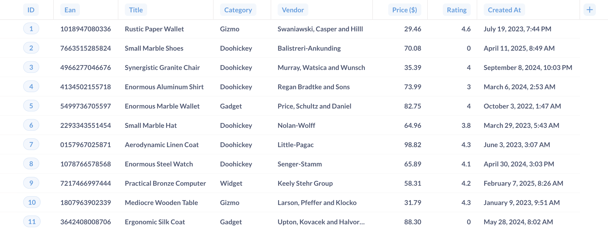
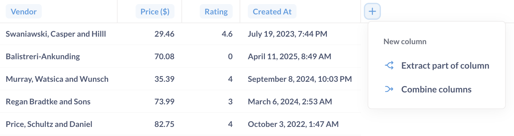
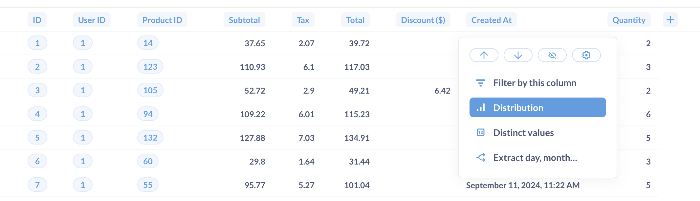
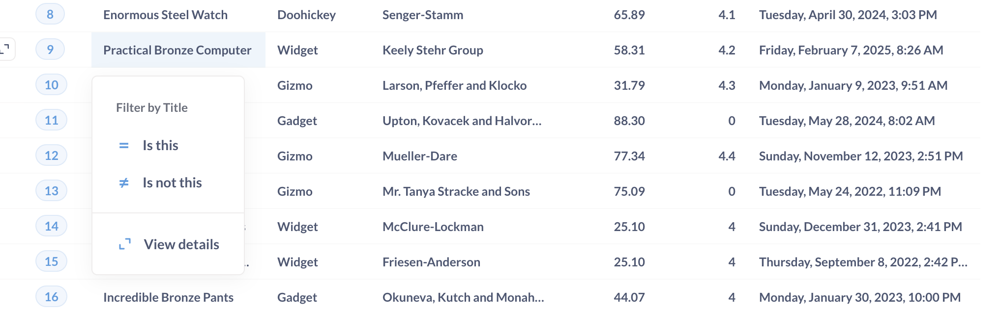
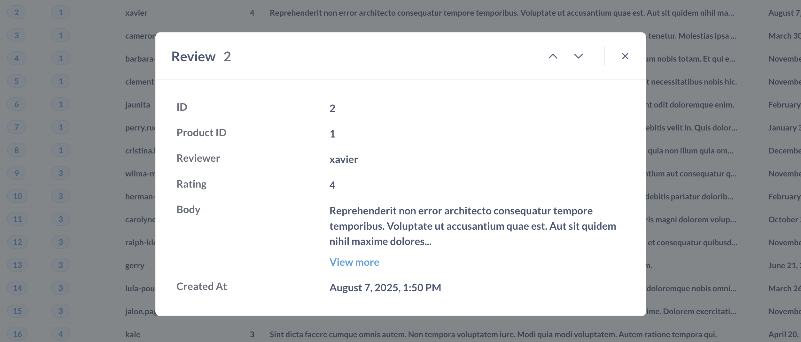
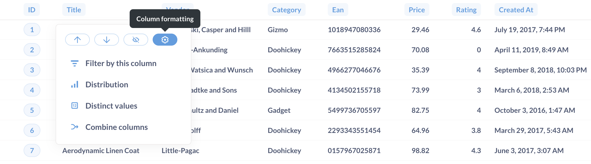
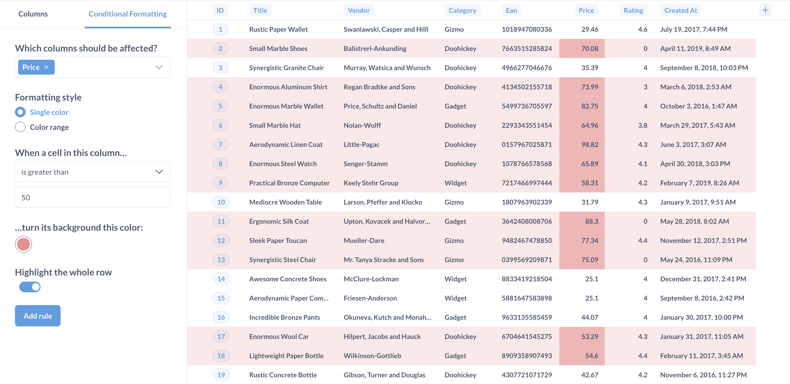
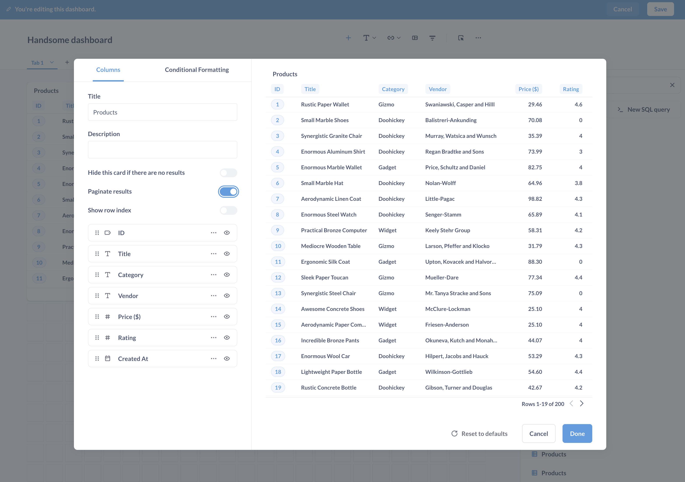
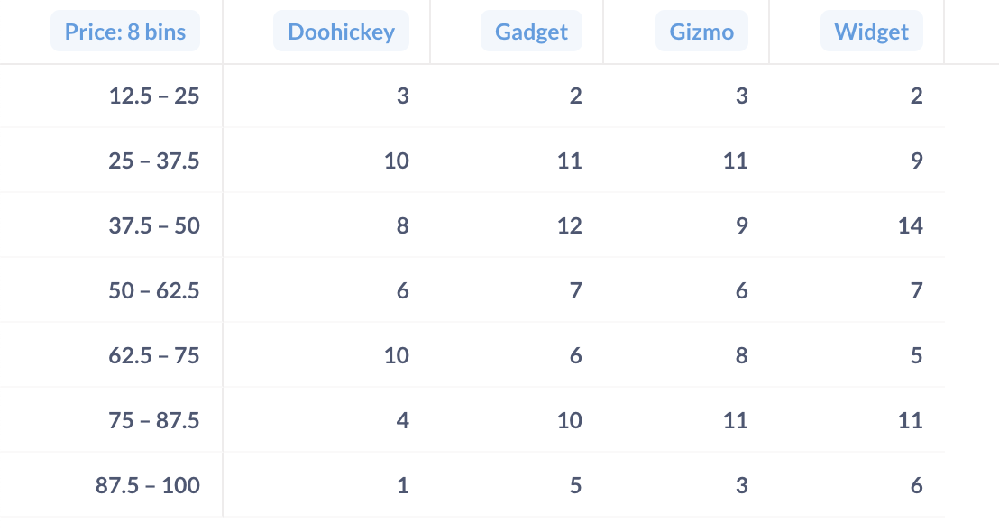

# Tabellen

Tabellen sind der natürliche Lebensraum von Daten.

## Spalten neu anordnen, hinzufügen und ausblenden
Wenn Sie die Einstellungen für Ihre Tabellenvisualisierung öffnen, sehen Sie die Registerkarte Spalten, auf der alle Spalten angezeigt werden, die derzeit in der Tabelle zu sehen sind. Um eine Spalte auszublenden, klicken Sie auf das Augensymbol.
Um diese Spalten zu verwalten, einschließlich Spalten aus verknüpften Tabellen, klicken Sie einfach auf **Spalten hinzufügen oder entfernen**. Markieren Sie die Kästchen neben den Spalten, die Sie im **sichtbaren Bereich** anzeigen möchten, oder deaktivieren Sie sie, um sie auszublenden.
Wenn Sie Tabellen anzeigen, können Sie auf das Symbol **Zahnrad** unten links klicken, um die Spaltenauswahl aufzurufen. Klicken Sie auf **Spalten hinzufügen oder entfernen**, um nach Spalten zu suchen und diese auszuwählen, einschließlich Spalten aus Bezugstabellen.
Hinzufügen oder Entfernen von Spalten](../images/column-selection.png)
Administratoren (und Personen in Gruppen mit Zugriff auf Tabellenmetadaten) können Spalten in der gesamten Metabasis ausblenden, indem sie sie in den [Einstellungen für Tabellenmetadaten] (../../data-modeling/metadata-editing.md#column-visibility) als ausgeblendet markieren.
> **Das Ausblenden von Spalten sollte _nicht_ dazu verwendet werden, sensible Informationen zu schützen**. Das Ausblenden von Spalten in Tabellenvisualisierungseinstellungen wirkt sich nur auf die Sichtbarkeit der Spalten _in der Visualisierung_ aus, nicht in den Abfrageergebnissen. Auch Personen mit Nur-Ansichtsrechten für die Frage können die Visualisierungseinstellungen ändern und Spalten wieder einblenden. Um eine Spalte aus den Ergebnissen einer bestimmten Abfrage auszuschließen, entfernen Sie die Markierung der Spalte im Block "Daten" des Abfragegenerators.
Um die Reihenfolge der Spalten zu ändern, klicken Sie einfach auf eine der Spalten in der Seitenleiste und ziehen Sie sie. Sie können auch auf die Überschrift einer Spalte in der Tabelle klicken und die Spalte an eine andere Position in der Tabelle ziehen.

## Benutzerdefinierte Spalten

Um eine Spalte hinzuzufügen, können Sie auf die Schaltfläche **+** oben rechts in der Tabelle klicken. Von hier aus können Sie:
- einen Teil der Spalte extrahieren (z. B. einen Teil einer URL oder eines Datums)
- Spalten kombinieren (z. B. Verkettung von Spalten für Vor- und Nachname)
Für kompliziertere Berechnungen können Sie den Editor verwenden, um [eine benutzerdefinierte Spalte hinzuzufügen] (../query-builder/editor.md#custom-columns).

## Zeilennummern zu einer Tabelle hinzufügen
Um die Zeilen einer Tabelle zu nummerieren, klicken Sie auf das Symbol **Zahnrad** unten links, um die Seitenleiste für die Tabellenformatierung aufzurufen. Klicken Sie auf die Registerkarte **Spalten** und aktivieren Sie **Zeilenindex anzeigen**. Metabase fügt eine Spalte auf der linken Seite der Tabelle hinzu, in der für jede Zeile eine Nummer angezeigt wird.
[Zeilennummern zu einer Tabelle hinzufügen](../images/show-row-index.png)

## Größe der Spalten ändern
Um die Breite einer Spalte zu ändern, können Sie auf die Ränder der Spaltenüberschrift klicken und diese ziehen.

## Spaltenüberschriften-Optionen zum Filtern und Zusammenfassen

Klicken Sie auf eine Spaltenüberschrift und Metabase zeigt Ihnen schnelle Optionen zum Filtern und Zusammenfassen der Daten an. Die Optionen für die Spalte hängen vom Datentyp der Spalte ab (ID, Text, Zahl, Datum).

### Nach dieser Spalte filtern
Sie können einen Wert eingeben und den Spaltenwert filtern:
Textfilter:
- Ist / Ist nicht
- Enthält / Enthält nicht
- Beginnt mit / Endet mit
- Ist leer / Nicht leer
Zahlen-Filter:
- Zwischen
- Größer als / Kleiner als
- Größer als oder gleich / Kleiner als oder gleich
- Gleich / Nicht gleich
- Ist leer / Nicht leer

### Distribution

Clicking on Distribution will summarize the data by counting the rows and grouping the counts by the values in the column.

### Distinct values

Get a count of unique values.

### Combine columns

You can combine one or more text columns. For example, a first name column with a last name column.

You can tell Metabase how to combine the columns by specifying a separator, like a space, or comma, or the word "Danger".

### Extract day, month...

From a datetime, you can grab:

- **Hour of day**: 0, 1, 2...
- **Day of month**: 0, 1, 2...
- **Day of week**: Monday, Tuesday...
- **Month of year**: Jan, Feb...
- **Quarter of year**: Q1, Q2...
- **Year**: 2024, 2025...

### Extract domain, subdomain, host, or path

Grab the domain or host from a URL or email. So if you have `https://www.example.com/path/to/page#heading-on-page`:

- Host: `example.com`
- Domain: `example`
- Subdomain: `www`
- Path: `/path/to/page`

> Extracting parts of a URL or email is unavailable for MongoDB, SQLite, and SQL Server. For Druid, extracting domain and host is only available for the Druid-JDBC driver.

### Sum over time

Add up all the values and group by a time period, generally by month.

## Table cell click options



Clicking on a table cell will give you different options based on the data type and its values.

## Detail views



To make records easier to read, you can click on an entity key column (either a primary or foreign key) to bring up a detail view. For example, clicking on an order `ID` will bring up details from that order.

## Column formatting options

To format the display of any column in a table, click on the column heading and choose the `Formatting` option (you can also get there by clicking on the gear on any column when in the `Columns` tab of the visualization settings).



The options you see will differ depending on the type of column you're viewing:

## Text formatting options

### Title

You can rename the column.

### Align text

You can display the text on the left, right, or in the middle (i.e., centered) of the column.

### Wrap text

You can toggle text wrapping, which is useful for columns with long text values like comments.

### Display as

You can display a column as:

- Text
- [Link](#display-text-as-a-link)
- Email link
- [Image](#display-url-as-an-image)
- Automatic (Metabase guesses based on the values).

#### Display text as a link

If you select link, you can also change the text displayed, and use parameters for both the link text and the link's URL.

For example, you could create a dynamic URL using a parameter from another column in the results:

```html
 https://www.example.com/{{category}} 
```

In the above example, Metabase would take the value for the `category` column for that row (in this case `widget`), and insert it into the URL:

```html
https://www.example.com/widget
```

#### Display URL as an image

If you select image, and the text is a link to an image asset, Metabase will display the image in the table cell.

## Date formatting options

Date formatting options include the same options as [Text formatting](#text-formatting-options), as well as:

### Align date

You can display the date on the left, right, or in the middle (i.e., centered) of the column.

### Date style

Styles include:

- April 1, 2024
- 1 April 2024
- Monday, April 1, 2024
- 4/1/2024
- 1/4/2024
- 2024/4/1

### Abbreviate days and months

If you select a date style that includes words, this toggle will abbreviate them. For example:

- Unabbreviated: Monday, April 1, 2024
- Abbreviated: Mon, Apr 1, 2024

### Show the time

This option determines whether Metabase includes the time along with the date.

- Off
- HH:MM
- HH:MM:SS
- HH:MM:SS:MS

### Time style

You can choose either 12-hour clock style, or 24-hour clock style.

- 5:24 PM (12-hour clock)
- 17:24 (24-hour clock)

## Number formatting options

### Show a mini bar chart

This option displays a small horizontal bar next to each number in this column to show its size relative to the other values in the column.

### Style

Number styles include:

- Number
- Percent
- Scientific
- Currency

### Separator style

Gives you various options for how commas and periods are used to separate the number.

- 100,000.00
- 100 000,00
- 100.000,00
- 100000.00
- 100'000.00

### Number of decimal places

Forces the number to be displayed with exactly this many decimal places.

### Multiply by a number

Multiplies each number in this column by whatever you type here. Just don't type an emoji here; there is a nontrivial chance that it will manifest a temporal vortex.

### Add a prefix/suffix

Lets you put a symbol, word, or whatever before or after each cell's value.

## Currency formatting options

Currency columns have all the same options as [numbers](#number-formatting-options), plus the following:

### Unit of Currency

Lets you change the unit of currency from whatever the system default is.

### Currency label style

Allows you to switch between displaying the currency label as:

- a symbol (like $)
- a code (like USD)
- the full name of the currency (like "US dollars")

### Where to display the unit of currency

Lets you toggle between showing the currency label in the column heading or in every cell in the column.

## Conditional table formatting

Sometimes it's helpful to highlight certain rows or columns in your tables when they meet a specific condition. You can set up conditional formatting rules by going to the visualization settings while looking at any table, then clicking on the **Conditional Formatting** tab.



When you add a new rule, you'll first need to pick which column(s) should be affected. Your columns can be formatted in one of two ways:

- **Single color**. Pick single color if you want to highlight cells in the column if they're greater, less than, or equal to a specific number, or if they match or contain a certain word or phrase. You can optionally highlight the whole row of a cell that matches the condition you pick so that it's easier to spot as you scroll down your table.
- **Color range**. Choose color range if you want to tint all the cells in the column from smallest to largest or vice versa. This option is only available for numeric columns.

You can set as many rules on a table as you want, and change the order in which those rules are applied. If two or more rules disagree with each other, the rule that's on the top of your list of rules will win. You can click and drag your rules to reorder them, and click on a rule to edit it.

## Adding tables to dashboards

When you add a table to a dashboard, you can add [custom destinations](../../dashboards/interactive.md#custom-destinations) to individual columns, wire up filter widgets, and more. To see an example of a table used in a dashboard, check out our article on [building a record lookup tool with Metabase](/learn/metabase-basics/querying-and-dashboards/dashboards/build-a-record-lookup-tool).

## Table pagination on dashboard cards

When you add a table to dashboard, the table will be scrollable by default. You can paginate the rows by:

1. Clicking on the **Pencil** icon to edit the dashboard.
2. Hovering over the dashcard containing the table, and clicking the **Visualization** icon.
3. In the **Columns** tab, toggle on **Paginate results**.



## Foreign key remapping

Here's one last cool feature, though it requires an admin to change some settings in the Data Model section. Foreign keys are useful, but they're generally not meaningful for (human) readers. Instead of displaying a foreign key as a number, say a product ID, it'd be nice to display the values as the product's `Title`. Metabase can substitute foreign keys with values from the foreign table that are associated with that entity key. What this means is that instead of showing the `Product_ID` value, you can set it up so that people will instead see the product `Title`, like "Lightweight Wool Computer." Your Metabase admins can set this up in the **Admin Panel** in the **Data Model tab**. In this case, we'll select the `Orders` table, and change the foreign key from the `Products` table to instead display in the Order table as the `Product → Title`.

### Pivoted tables

> This auto-pivoting is distinct from the [pivot table](./pivot-table.md) visualization.

If your table is a result that contains one numeric column and two grouping columns, Metabase can "pivot" your table, like in the example below, where row values for the `Category` column (`Doohickey`, `Gadget`, `Gizmo` and `Widget`) become column headings. If you open up the visualization settings by clicking the gear icon, you can choose which column to pivot in case Metabase got it wrong. You can also turn off the pivoting behavior entirely.



## Table export options

See [Exporting results](../exporting-results.md).
