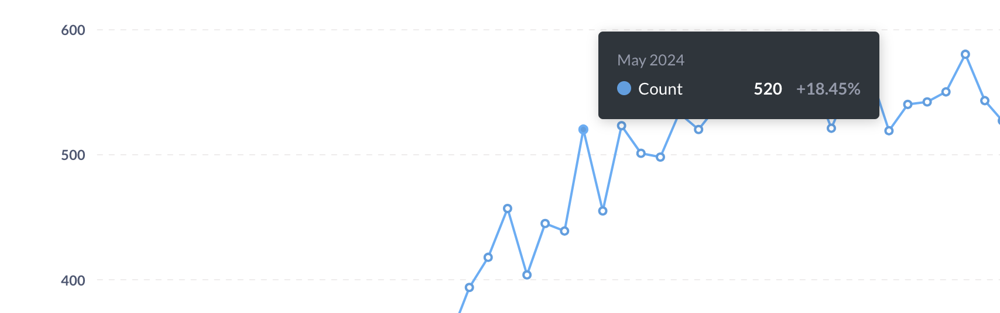
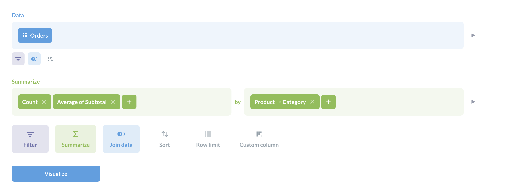
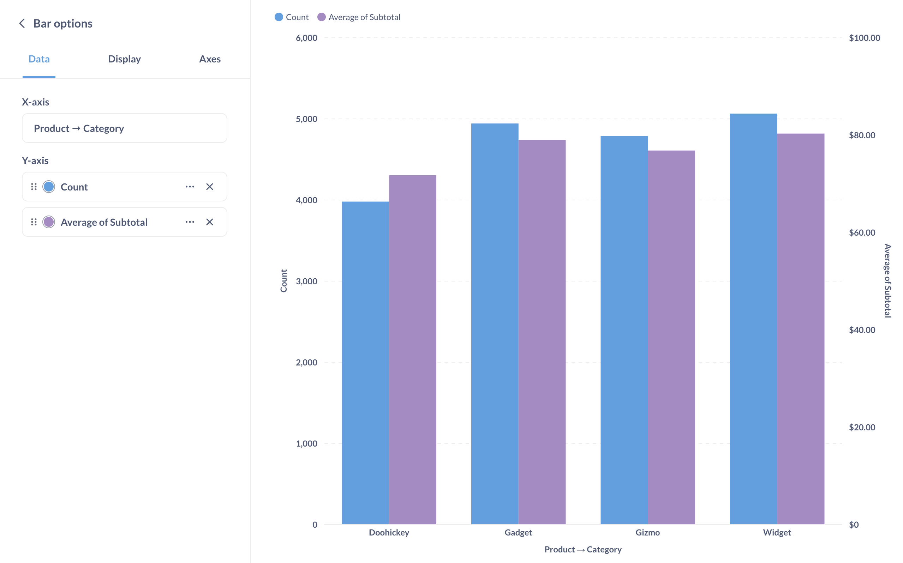
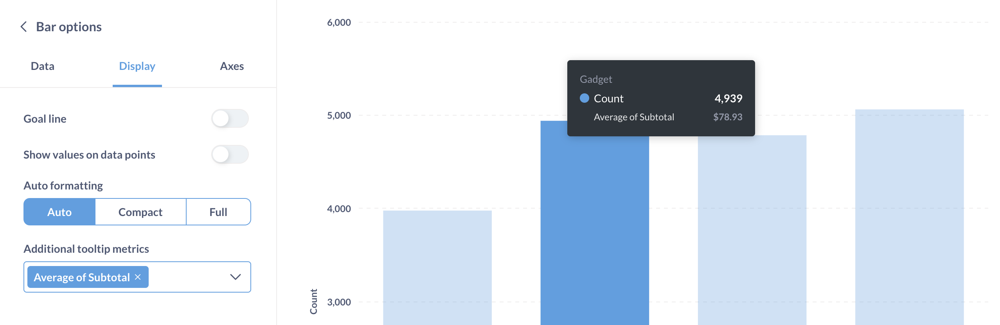

# Tooltips

Wenn Sie den Mauszeiger über einen Datenpunkt in einem Diagramm in der Metabase bewegen, wird ein Tooltip über diese Daten angezeigt.

## Anpassen von Tooltips mit mehreren Metriken

In Linien-, Balken- und Flächendiagrammen können Sie die Werte mehrerer Metriken entweder im Diagramm oder in den Tooltips anzeigen, die Metabase den Datenpunkten beim Verweilen hinzufügt.

Wenn Sie z. B. eine Frage mit zwei Metriken haben (d. h. zwei Zusammenfassungen - sie müssen nicht Metabase [metrics](../../data-modeling/metrics.md) sein), wie diese Frage, die sowohl die Anzahl als auch den Durchschnitt der Zwischensumme enthält:

Sie können die Zusammenfassungen wie folgt anzeigen, wobei sowohl die Anzahl als auch der Durchschnitt im Diagramm angezeigt werden.

Sie können auch eine der Kennzahlen im Diagramm anzeigen und die andere(n) Kennzahl(en) in den Tooltip einfügen. Dazu entfernen Sie eine der Metriken aus dem Diagramm, indem Sie in den Visualisierungseinstellungen auf die Registerkarte **Daten** gehen und auf das X der zu entfernenden Metrik(en) klicken.

Wenn Sie eine Metrik entfernen, haben Sie die Möglichkeit, sie als zusätzliche Metrik zur QuickInfo hinzuzufügen. Klicken Sie in den Visualisierungseinstellungen auf die Registerkarte **Anzeige** und fügen Sie **Zusätzliche Tooltip-Metriken** hinzu. Nur Metriken, die im Verdichtungsschritt der Frage enthalten sind, können der QuickInfo hinzugefügt werden.

Hier haben wir die Zählung im Diagramm beibehalten, aber wenn Sie mit dem Mauszeiger über einen Balken im Diagramm fahren, enthält die QuickInfo jetzt auch den entsprechenden Durchschnittswert.
