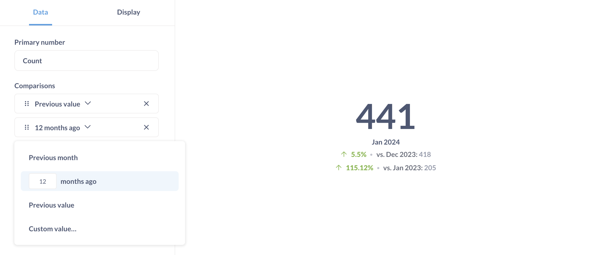

# Trend

Die**Trend**-Visualisierung eignet sich hervorragend, um zu zeigen, wie eine einzelne Zahl im Vergleich zu:

- Vorangegangene (r) Zeitraum(e).
- Benutzerdefinierte Werte, wie z. B. ein Ziel oder eine Vorgabe.
- Werte aus einer anderen Spalte.

Um diese Visualisierung zu verwenden, müssen Sie eine einzelne Zahl haben, die nach einem Zeitfeld gruppiert ist, wie z. B. die Anzahl der Aufträge nach Erstellungsdatum.

Standardmäßig zeigt das Trenddiagramm den Wert der Zahl während des letzten Zeitraums an sowie den Anstieg oder Rückgang der Zahl im Vergleich zum vorherigen Zeitraum. Der Zeitraum wird durch das Feld Gruppieren nach bestimmt; wenn Sie nach Tag gruppieren, zeigt der Trend den letzten Tag im Vergleich zum Tag davor an.

Standardmäßig werden in Trends Erhöhungen als grün (d. h. "gut") und Verminderungen als rot ("schlecht") angezeigt. Wenn es sich bei Ihrer Zahl um etwas handelt, bei dem ein Anstieg schlecht und ein Rückgang gut ist (z. B. Absprungrate oder Kosten), können Sie dieses Verhalten in den Visualisierungseinstellungen umkehren.

## Hinzufügen von Vergleichen

Um einen Vergleich hinzuzufügen, klicken Sie auf das**Zahnradsymbol** unten links (neben Visualisierung). Auf der Registerkarte**Daten** in der linken Seitenleiste klicken Sie auf**Vergleich hinzufügen**. Sie können wählen zwischen:

-**Vorheriger Zeitraum**
-**Vorheriger Wert**. Wenn es keinen vorherigen Wert gibt, ignoriert Metabase den Wert, so dass im Diagramm kein Vergleich mit einem Nullwert angezeigt wird.
- **Benutzerdefinierter Wert**.
- **Wert aus einer anderen Spalte**. Die Metabase zeigt diese Option nur an, wenn Ihre Ergebnisse mehrere Spalten mit Aggregatwerten enthalten (z. B. wenn Sie zwei Summenspalten haben).

Sie können bis zu drei Vergleiche hinzufügen.
