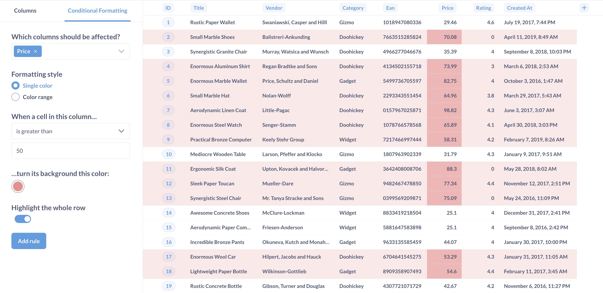
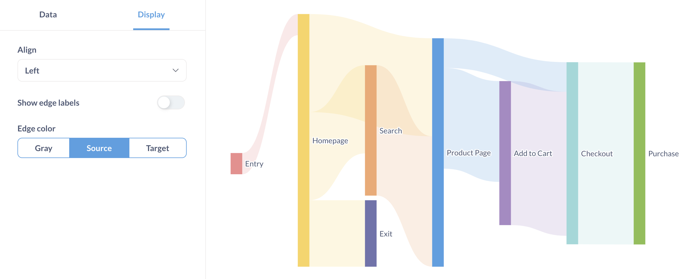

# Überblick über die Visualisierung

## Torten-, Donut- und Sunburst-Diagramme

Ein [Kuchendiagramm oder Donut-Diagramm](./pie-or-donut-chart.md) kann verwendet werden, um eine Kennzahl nach einer einzigen Dimension aufzuschlüsseln, insbesondere wenn die Anzahl der möglichen Aufschlüsselungen gering ist, wie z. B. Konten nach Plan.

Ein [sunburst chart](./pie-or-donut-chart.md) ist ein Kreisdiagramm mit mehr als einem Ring, um die Daten nach zusätzlichen Dimensionen aufzuschlüsseln.

[Donut](../images/pie-sunburst-demo.png)

## Pivot-Tabellen

[MitPivot-Tabellen(./pivot-table.md) können Sie Zeilen und Spalten vertauschen, Daten gruppieren und Zwischensummen in Ihre Tabelle aufnehmen. Sie können eine oder mehrere Metriken nach einer oder mehreren Dimensionen gruppieren.

## Fortschrittsbalken

[Fortschrittsbalken(./progress-bar.md) dienen dem Vergleich einer einzelnen Zahl mit einem von Ihnen festgelegten Zielwert.

[Fortschrittsbalken](../images/progress.png)

## Zeilendiagramme

[Zeilendiagramme(./line-bar-and-area-charts.md) eignen sich gut für die Visualisierung von Daten, die nach einer Spalte mit vielen möglichen Werten gruppiert sind, wie z. B. ein Feld mit dem Namen eines Anbieters oder eines Produkts.

## Tabellen

Die Option [Tabelle](./table.md) ist gut geeignet, um tabellarische Daten zu betrachten (duh), oder für Listen von Dingen wie Benutzern oder Bestellungen.

## Trends

Die [Trend](./trend.md) Visualisierung eignet sich hervorragend, um zu zeigen, wie sich eine einzelne Zahl zwischen zwei Zeiträumen verändert hat.

## Histogramme

Wenn Sie ein Balkendiagramm wie "Anzahl der Nutzer nach Alter" haben, bei dem die x-Achse eine Zahl ist, erhalten Sie eine spezielle Art von Balkendiagramm, das [Histogramm](./line-bar-and-area-charts.md), bei dem jeder Balken einen Wertebereich (ein so genanntes "bin") darstellt.

[Histogramm](../images/histogram.png)

## Sankey-Diagramme

[Sankey-Diagramme(./sankey.md) zeigen, wie Daten durch mehrdimensionale Schritte fließen.

## Wasserfalldiagramme

[Wasserfalldiagramme(./waterfall-chart.md) sind eine Art Balkendiagramm, das sich zur Darstellung von Ergebnissen eignet, die sowohl positive als auch negative Werte enthalten.

[Wasserfalldiagramm](../images/waterfall-chart.png)

## Streudiagramme und Blasendiagramme

[Streudiagramme(../scatterplot-or-bubble-chart.md) sind nützlich, um die Korrelation zwischen zwei Variablen zu visualisieren, z. B. das Alter der Nutzer Ihrer App mit der Anzahl der Dollar, die sie für Ihre Produkte ausgegeben haben, zu vergleichen.

## Gestaltung und Formatierung von Daten in Diagrammen

Sie können auf Formatierungsoptionen für die in einem Diagramm verwendeten Spalten zugreifen. Öffnen Sie einfach die Visualisierungseinstellungen, indem Sie auf das Symbol **Zahnrad** unten links klicken.

Die Optionen sind je nach Diagramm unterschiedlich und können Einstellungen für die Daten des Diagramms, seine Anzeige und seine Achsen umfassen.

Siehe auch [Formatierungsvorgaben](../../data-modeling/formatting.md).

## Weitere Lektüre

- [Diagramme mit mehreren Reihen](../../dashboards/multiple-series.md)
- [Erscheinungsbild](../../configuring-metabase/appearance.md)
- [Bewährte Verfahren für BI-Dashboards](https://www.metabase.com/learn/metabase-basics/querying-and-dashboards/dashboards/bi-dashboard-best-practices.html)# Überblick über die Visualisierung

## Torten-, Donut- und Sunburst-Diagramme

Ein [Kuchendiagramm oder Donut-Diagramm](./pie-or-donut-chart.md) kann verwendet werden, um eine Kennzahl nach einer einzigen Dimension aufzuschlüsseln, insbesondere wenn die Anzahl der möglichen Aufschlüsselungen gering ist, wie z. B. Konten nach Plan.

Ein [sunburst chart](./pie-or-donut-chart.md) ist ein Kreisdiagramm mit mehr als einem Ring, um die Daten nach zusätzlichen Dimensionen aufzuschlüsseln.

[Donut](../images/pie-sunburst-demo.png)

## Pivot-Tabellen

[MitPivot-Tabellen(./pivot-table.md) können Sie Zeilen und Spalten vertauschen, Daten gruppieren und Zwischensummen in Ihre Tabelle aufnehmen. Sie können eine oder mehrere Metriken nach einer oder mehreren Dimensionen gruppieren.

## Fortschrittsbalken

[Fortschrittsbalken(./progress-bar.md) dienen dem Vergleich einer einzelnen Zahl mit einem von Ihnen festgelegten Zielwert.

[Fortschrittsbalken](../images/progress.png)

## Zeilendiagramme

[Zeilendiagramme(./line-bar-and-area-charts.md) eignen sich gut für die Visualisierung von Daten, die nach einer Spalte mit vielen möglichen Werten gruppiert sind, wie z. B. ein Feld mit dem Namen eines Anbieters oder eines Produkts.

## Tabellen

Die Option [Tabelle](./table.md) ist gut geeignet, um tabellarische Daten zu betrachten (duh), oder für Listen von Dingen wie Benutzern oder Bestellungen.

## Trends

Die [Trend](./trend.md) Visualisierung eignet sich hervorragend, um zu zeigen, wie sich eine einzelne Zahl zwischen zwei Zeiträumen verändert hat.

## Histogramme

Wenn Sie ein Balkendiagramm wie "Anzahl der Nutzer nach Alter" haben, bei dem die x-Achse eine Zahl ist, erhalten Sie eine spezielle Art von Balkendiagramm, das [Histogramm](./line-bar-and-area-charts.md), bei dem jeder Balken einen Wertebereich (ein so genanntes "bin") darstellt.

[Histogramm](../images/histogram.png)

## Sankey-Diagramme

[Sankey-Diagramme(./sankey.md) zeigen, wie Daten durch mehrdimensionale Schritte fließen.

## Wasserfalldiagramme

[Wasserfalldiagramme(./waterfall-chart.md) sind eine Art Balkendiagramm, das sich zur Darstellung von Ergebnissen eignet, die sowohl positive als auch negative Werte enthalten.

[Wasserfalldiagramm](../images/waterfall-chart.png)

## Streudiagramme und Blasendiagramme

[Streudiagramme(../scatterplot-or-bubble-chart.md) sind nützlich, um die Korrelation zwischen zwei Variablen zu visualisieren, z. B. das Alter der Nutzer Ihrer App mit der Anzahl der Dollar, die sie für Ihre Produkte ausgegeben haben, zu vergleichen.

## Gestaltung und Formatierung von Daten in Diagrammen

Sie können auf Formatierungsoptionen für die in einem Diagramm verwendeten Spalten zugreifen. Öffnen Sie einfach die Visualisierungseinstellungen, indem Sie auf das Symbol **Zahnrad** unten links klicken.

Die Optionen sind je nach Diagramm unterschiedlich und können Einstellungen für die Daten des Diagramms, seine Anzeige und seine Achsen umfassen.

Siehe auch [Formatierungsvorgaben](../../data-modeling/formatting.md).

## Weitere Lektüre

- [Diagramme mit mehreren Reihen](../../dashboards/multiple-series.md)
- [Erscheinungsbild](../../configuring-metabase/appearance.md)
- [Bewährte Verfahren für BI-Dashboards](https://www.metabase.com/learn/metabase-basics/querying-and-dashboards/dashboards/bi-dashboard-best-practices.html)
