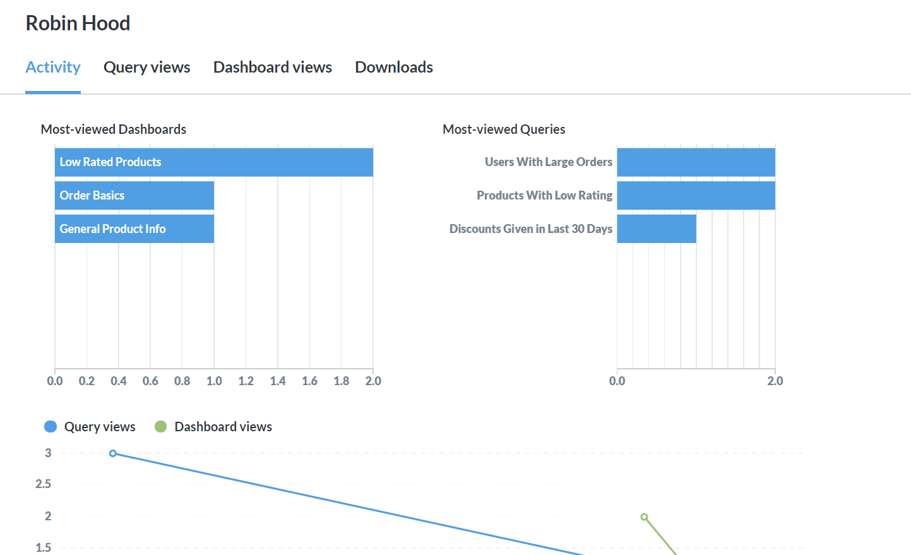
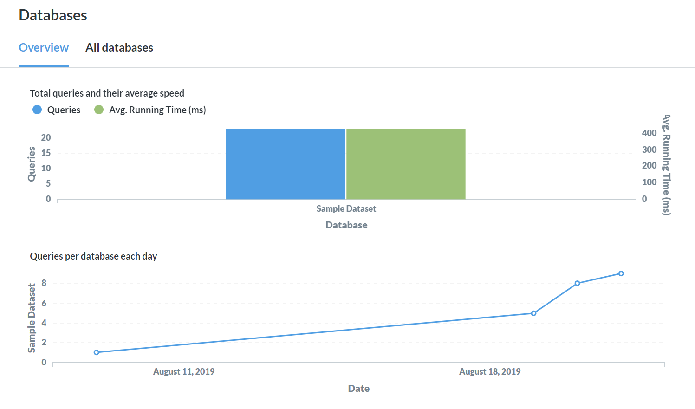
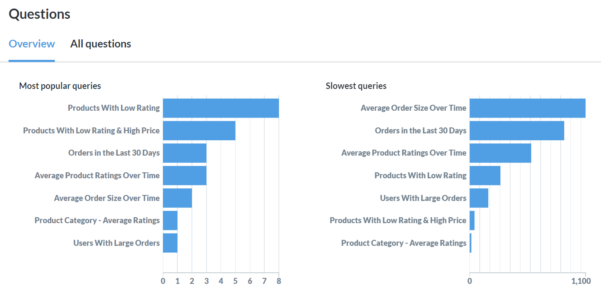
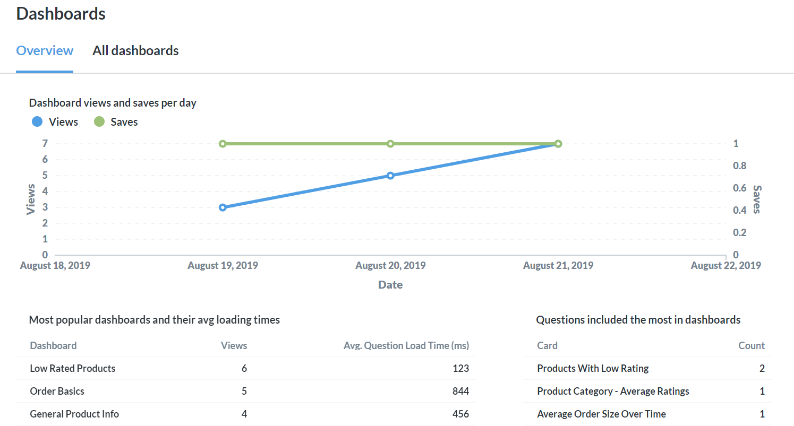

# Auditing-Tools

> Die Überwachungswerkzeuge sind veraltet. Schauen Sie sich stattdessen die (viel bessere) [Nutzungsanalyse](./usage-analytics.md) an.



Als Metabase-Administrator wissen Sie bereits, wie wichtig es ist, Daten zu nutzen, um zu verstehen, wie Personen mit Ihren Produkten oder Dienstleistungen interagieren. Mit dem Audit-Tool können Sie die Metabase nutzen, um zu verstehen, wie die Personen in Ihrem Unternehmen die Metabase nutzen. Das ist, nun ja, meta!

Um die Audit-Protokolle anzuzeigen, klicken Sie oben rechts auf dem Bildschirm auf das Symbol **Zahnrad** > **Verwaltungseinstellungen** > **Audit**. Es sind eine Menge Daten verfügbar, nicht nur über Ihre Mitarbeiter, sondern auch über Ihre Fragen, Dashboards, Datenbanken und vieles mehr! Im Folgenden führen wir Sie durch die einzelnen Abschnitte.

## Menschen

### Teammitglieder

Verwenden Sie den Bereich**Personen**, um einen besseren Überblick über die Interaktion der Mitarbeiter mit Metabase zu erhalten. Vor allem bei der Einführung von Metabase in Ihrem Unternehmen sollten Sie die Registerkarte**Übersicht** im Auge behalten. Hier finden Sie Daten darüber, wie viele aktive und neu erstellte Konten Sie jeden Tag haben. Weiter unten auf der Seite sehen Sie Diagramme, die Ihnen zeigen, welche Personen sich am meisten engagieren.

[Teammitglieder](./images/audit-team.png)

Der Bereich**Teammitglieder** bietet eine Reihe weiterer Optionen zur Anzeige der Nutzungsdaten Ihres Teams. Auf der Registerkarte**Alle Mitglieder** finden Sie eine Liste Ihrer Teammitglieder und Statistiken über ihre Aktivitäten, z. B. wann sie zuletzt aktiv waren.

Die Registerkarte**Prüfungsprotokoll** zeigt in chronologischer Reihenfolge jede Abfrage an, wer sie angesehen hat und wann. Wenn die Person ihre Abfrage nicht gespeichert hat, wird ihr Name als "Ad-hoc" aufgeführt. Jeder Abfragename kann angeklickt werden, um weitere Details über die Interaktionen der Person mit der Abfrage anzuzeigen, einschließlich einer vollständigen Änderungshistorie. Sie können die Abfrage auch in der Metabase anzeigen lassen. Beachten Sie, dass dieser Link immer die neueste Version der Abfrage anzeigt - nutzen Sie die Änderungshistorie, um Änderungen im Laufe der Zeit zu sehen.

Im Bereich "Personen" können Namen angeklickt werden, um das Profil einer bestimmten Person aufzurufen. Dieses Profil umfasst:

- Dashboard-Ansichten
- Abfrage-Ansichten
- Herunterladen
- Abonnements und Warnungen

## Daten

Der Bereich Daten konzentriert sich auf Ihre Datenbanken, Schemata und Tabellen und ist in entsprechende Abschnitte unterteilt. Schauen Sie hier nach, wenn Sie versuchen, Abfragen und Schemata zu finden, die optimiert werden müssen. Jeder Abschnitt bietet Visualisierungen zur Nutzung und Geschwindigkeit von Abfragen für Ihre Datenbanken, Schemata oder Tabellen. Sie können auch Listen mit Statistiken über alle Ihre Datenbanken, Schemata und Tabellen anzeigen.

## Artikel

Der Abschnitt **Elemente** befasst sich mit Fragen, Dashboards, Downloads sowie Abonnements und Warnungen.

### Fragen

Der Abschnitt Fragen zeigt Ihnen die beliebtesten und die langsamsten Abfragen an. Wenn Abfragen, die Sie für wichtig halten, nicht in der Liste der beliebtesten Abfragen auftauchen, sollten Sie sicherstellen, dass sich Ihr Team auf die richtigen Dinge konzentriert.

Wenn wichtige Abfragen in der Liste der langsamsten Abfragen auftauchen, sollten Sie sich um deren Optimierung kümmern. Eine Möglichkeit ist die Anpassung der [Caching-Einstellungen](../configuring-metabase/caching.md), aber es gibt auch viele andere Möglichkeiten. Um festzustellen, ob Ihre Optimierungsbemühungen in die richtige Richtung gehen, können Sie die Visualisierung "Abfrageaufrufe und Geschwindigkeit pro Tag" unten auf der Seite verwenden.

Eine Liste aller Ihrer Fragen ist ebenfalls verfügbar, und Sie können verschiedene Datenpunkte zu jeder Frage auf einen Blick sehen:

- Abfrageläufe
- Durchschnittliche Laufzeit
- Cache-Dauer
- Gesamtlaufzeit
- Datenbank
- Tabelle
- Sammlung
- Öffentlicher Link

Sie können auch auf eine beliebige Frage klicken, um eine detailliertere Profilansicht zu erhalten:

- Aktivität anzeigen
- Revisionsverlauf
- Ein vollständiges Prüfprotokoll darüber, wer die Frage wann angesehen hat

### Dashboards

Der Abschnitt **Dashboards** hilft Ihnen zu verstehen, welche Dashboards von den Nutzern betrachtet werden, und sicherzustellen, dass sie reibungslos funktionieren. Wenn Sie feststellen, dass ein beliebtes Dashboard eine hohe durchschnittliche Ladezeit für Fragen aufweist, können Sie dies mithilfe des oben beschriebenen Abschnitts "Fragen" näher untersuchen.

Eine Liste all Ihrer Dashboards ist ebenfalls verfügbar, und Sie können verschiedene Datenpunkte zu jedem Dashboard auf einen Blick sehen, wie z. B:

- Anzahl der Ansichten
- Durchschnittliche Ausführungszeit der Frage (ms)
- Anzahl der Karten
- Gesichert von
- Dauer des Cache
- Öffentlicher Link
- Gesichert am
- Zuletzt bearbeitet am

### Downloads

Verwenden Sie den Abschnitt **Downloads**, um zu erfahren, welche Personen Daten herunterladen (oder exportieren) und wie groß (Anzahl der Zeilen) die Downloads sind, die sie durchführen. Dieser Bereich enthält einige Visualisierungen sowie eine Liste aller Downloads.

### Abonnements und Alarme

Hier können sich Administratoren einen Überblick über alle [Dashboard-Abonnements][Dashboard-Abonnements] und [Alerts][Alerts] verschaffen, die derzeit für diese Metabase aktiv sind.

- Dashboard-Name (oder Fragenname für Alerts)
- Empfänger
- Art (z. B. E-Mail oder Slack)
- Sammlung
- Frequenz
- Erstellt von
- Erstellt am
- Filter

Administratoren können Personen zu einem Abonnement oder einer Benachrichtigung hinzufügen oder daraus entfernen, indem sie auf die Nummer**Empfänger** des Elements klicken. Administratoren können das Abonnement oder die Benachrichtigung auch komplett löschen, indem sie auf das**X** in der entsprechenden Zeile klicken.

Jeder kann alle seine Abonnements und Benachrichtigungen einsehen, indem er auf das **Zahnradsymbol** oben rechts klickt und zu **Kontoeinstellungen** > **Benachrichtigungen** navigiert.

Weitere Informationen finden Sie unter [wie Berechtigungen mit Alarmen und Abonnements funktionieren](../permissions/notifications.md).

[alerts]: ../questions/alerts.md
[dashboard-subscriptions]: ../dashboards/subscriptions.md
