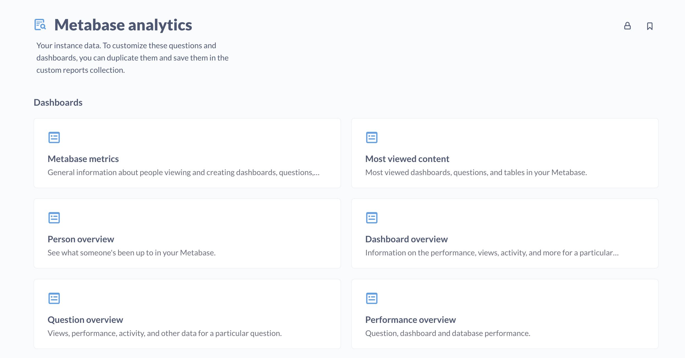

# Nutzungsanalyse



Die Sammlung**Nutzungsanalyse** ist eine spezielle Sammlung, die Fragen, Dashboards und Modelle enthält, die nur zur Ansicht bestimmt sind und die Ihnen helfen zu verstehen, wie die Benutzer Ihre Metabase nutzen.

Sie finden die Sammlung **Nutzungsanalyse** unter **Sammlungen** in der linken Navigationsleiste. Sie können auch benutzerdefinierte Berichte erstellen.

Diese Ressourcen sind nützlich für:

- **Verstehen der Nutzung**: Verstehen, wie die Nutzer Ihre Metadatenbank verwenden (z. B. neue Fragen, die aktivsten Personen und Gruppen usw.).
-Überprüfen der Aktivitäten**: Wissen, wer was wann angesehen oder getan hat, einschließlich der Verfolgung von Dashboard- und Frageansichten, Abfragen, Downloads und anderen Aktivitäten wie dem Ändern von Einstellungen oder dem Einladen von Personen zu Ihrer Metabase.
- **Verbesserung der Abläufe**: Sie kennen die langsamsten Dashboards und Fragen, wissen, wie Ihre Datenbanken arbeiten, wer die meisten Ressourcen verbraucht und so weiter.

> Die Metabase erstellt einige Standardbenutzerkonten, die Sie in Ihren Nutzungsanalysen sehen können, z. B. ` internal@metabase.com`. Siehe [Standardkonten](../people-and-groups/managing.md#default-user-accounts).

## Zugang zur Nutzungsanalyse

Sie finden die Sammlung**Nutzungsanalyse** unter**Sammlungen** in der Navigationsleiste. Standardmäßig können nur Administratoren die Nutzungsanalyse-Sammlung sehen, aber Administratoren können anderen Gruppen Zugriff auf die Sammlung gewähren. Sie können die Berechtigungen für die Sammlung unter **Admin-Einstellungen** > **Berechtigungen** > **Sammlungen** verwalten.

Es gibt nur zwei Zugriffsarten für die Nutzungsanalysesammlung: **Ansicht** und **Kein Zugriff**. Nicht einmal Administratoren können Nutzungsanalysen kuratieren.

Darüber hinaus verfügt diese Nutzungsanalysesammlung über eine standardmäßige Untersammlung namens "Benutzerdefinierte Berichte", die Sie zum Speichern von duplizierten/geänderten Fragen, Dashboards und Modellen verwenden können. Diese Untersammlung verfügt über dieselben Berechtigungen, ist aber nicht auf die Ansicht beschränkt; Administratoren haben standardmäßig den Zugriff "Curate" und können anderen Gruppen den Zugriff auf die Ansicht gewähren.

> Wenn Sie ein Upgrade von einer älteren Version als 48 durchführen, erhalten Personen in Gruppen mit Überwachungszugriff auch Zugriff auf die Sammlung Nutzungsanalyse. Nach dieser anfänglichen Eingliederung ist die Berechtigung für den Überwachungszugriff jedoch nicht mehr mit der Sammlung Nutzungsanalyse verknüpft; Sie müssen den Gruppen ausdrücklich Zugriff auf die Sammlung Nutzungsanalyse gewähren.

## Nutzungseinblicke für eine Frage, ein Dashboard oder ein Modell anzeigen

> Nur Personen in Gruppen mit Ansichtszugriff auf die Sammlung Nutzungsanalyse sehen diese Option Nutzungsanalyse.

So zeigen Sie Nutzungsanalysen für eine Frage, ein Dashboard oder ein Modell an:

- Besuchen Sie das Element.
- Klicken Sie auf die Info-Schaltfläche oben rechts.
- Klicken Sie auf **Einblicke**.

Metabase leitet Sie zum entsprechenden Nutzungs-Dashboard weiter und gibt die ID des Artikels ein.

## Wie lange Metabase Nutzungsdaten aufbewahrt

Standardmäßig bewahrt die Metabase die Daten über [Aktivität](#activity-log-model), [Ansichten](#view-log-model) und [Abfrageausführung](#query-log-model) für **720 Tage** auf. Zweimal täglich löscht die Metabase Zeilen, die älter als dieser Grenzwert sind. Sie können diesen Grenzwert ändern, indem Sie die Umgebungsvariable [`MB_AUDIT_MAX_RETENTION_DAYS`] anpassen(../configuring-metabase/environment-variables.md#mb_audit_max_retention_days).

Die Metabase Open Source Edition, die auch auf dem [Metabase Cloud Starter Plan](https://www.metabase.com/pricing/) verwendet wird, sammelt keine [Activity](#activity-log-model) und [View](#view-log-model) Daten. Wenn Sie vom Open Source/Starter-Tarif auf einen Pro- oder Enterprise-Tarif upgraden, sehen Sie in Usage Analytics nur Ansichts- und Aktivitätsdaten _ab dem Zeitpunkt des Upgrades_.

## Erstellen von benutzerdefinierten Berichten

- Meistgesehene Dashboards
- Meistgesehene Fragen
- Meist angesehene Tabellen

### Personenübersicht Dashboard

Sehen Sie, was jemand in Ihrer Metabase gemacht hat. Die Karten beinhalten:

- Mitglied von
- Aktive Warnungen
- Erstellte Fragen pro Monat
- Frageaufrufe pro Monat
- Meist angesehene Dashboards
- Meist angesehene Fragen
- Zuletzt angesehene Dashboards
- Zuletzt angesehene Fragen
- Zuletzt angesehene Tabellen
- Letzte Aktivität
- Letzte Abfragen

### Dashboard Übersicht Dashboard

Informationen über Dashboards, Fragen, Modelle und Tabellen. Die Karten enthalten:

- Dashboard-Metadaten
- Dashboard-Aufrufe pro Monat
- Leistung der Fragen
- Die aktivsten Personen auf diesem Dashboard
- Fragen in diesem Dashboard
- Die aktivsten Personen auf diesem Dashboard
- Fragen in diesem Dashboard
- Jüngste Aktivitäten auf dem Dashboard
- Abonnements auf diesem Dashboard

Übersichts-Dashboard für Fragen###

Ansichten, Leistung, Aktivität und andere Daten für eine bestimmte Frage. Die Karten enthalten:

- Metadaten zur Frage
- Frageaufrufe pro Monat
- Leistung der Frage
- Die aktivsten Personen zu dieser Frage
- Dashboards mit dieser Frage
- Letzte Aktivität zu dieser Frage
- Warnungen zu dieser Frage## Erstellen von benutzerdefinierten Berichten

-  Meistgesehene Dashboards
-  Meistgesehene Fragen
-  Meist angesehene Tabellen

### Personenübersicht Dashboard

Sehen Sie, was jemand in Ihrer Metabase gemacht hat. Die Karten beinhalten:

-  Mitglied von
-  Aktive Warnungen
- Erstellte  Fragen pro Monat
-  Frageaufrufe pro Monat
-  Meist angesehene Dashboards
-  Meist angesehene Fragen
-  Zuletzt angesehene Dashboards
-  Zuletzt angesehene Fragen
-  Zuletzt angesehene Tabellen
-  Letzte Aktivität
-  Letzte Abfragen

### Dashboard Übersicht Dashboard

Informationen über Dashboards, Fragen, Modelle und Tabellen. Die Karten enthalten:

-  Dashboard-Metadaten 
-  Dashboard-Aufrufe pro Monat
- Leistung der  Fragen 
-  Die aktivsten Personen auf diesem Dashboard
-  Fragen in diesem Dashboard
-  Die aktivsten Personen auf diesem Dashboard
-  Fragen in diesem Dashboard
-  Jüngste Aktivitäten auf dem Dashboard
-  Abonnements auf diesem Dashboard

 Übersichts-Dashboard für Fragen###

Ansichten, Leistung, Aktivität und andere Daten für eine bestimmte Frage. Die Karten enthalten:

- Metadaten zur  Frage 
-  Frageaufrufe pro Monat
- Leistung der  Frage 
-  Die aktivsten Personen zu dieser Frage
-  Dashboards mit dieser Frage
-  Letzte Aktivität zu dieser Frage
-  Warnungen zu dieser Frage
  
### Performance overview dashboard

Question, dashboard and database performance. Cards include:

- Slowest dashboards
- Dashboards consuming most resources
- Slowest questions
- Questions consuming the most resources
- Dashboards with more questions in the same tab
- Users consuming the most resources

> If you're using MySQL or MariaDB as your application database, the Performance overview dashboard won't display results for the cards displaying the 50th and 90th percentile query running times, because MySQL and MariaDB don't support the [Percentile aggregation](../questions/query-builder/expressions-list.md#percentile). We recommend using PostgreSQL as your application database.

### Content with cobwebs dashboard

Dashboards and questions that you could consider archiving. Cards include:

- Dashboards without recent reviews
- Questions without recent reviews
- Questions that don't belong to a dashboard

## Models

The Usage analytics collection includes a bunch of useful models based on Metabase's application database.

## Activity log model

Each row of this model describes one event of a particular topic. Fields include:

- ID
- Topic
- Timestamp
- End Timestamp
- User ID
- Model
- Model ID
- Details

The topics include:

- alert-create
- alert-delete
- card-create
- card-delete
- card-update
- dashboard-add-cards
- dashboard-create
- dashboard-delete
- dashboard-remove-cards
- install
- metric-create
- metric-delete
- metric-update
- segment-create
- segment-delete
- segment-update
- setting-update
- subscription-create
- subscription-delete
- user-joined

## View log model

Tracks views cards (which includes models), dashboards, and tables. Fields include:

- ID
- Timestamp
- User ID
- Entity Type (card, dashboard, or table)
- Entity ID
- Entity Qualified ID

## Query log model

Information about all queries Metabase ran across all dashboards. Fields include:

- Entity ID
- Started At
- Running Time Seconds
- Result Rows
- Is Native
- Query Source
- Error
- User ID
- Card ID
- Card Qualified ID
- Dashboard ID
- Dashboard Qualified ID
- Pulse ID
- Database ID
- Database Qualified ID
- Cache Hit
- Action ID

Query sources include:

- action
- ad-hoc
- collection
- csv-download
- dashboard
- embedded-dashboard
- embedded-csv-download
- embedded-json-download
- embedded-question
- embedded-xlsx-download
- json-download
- map-tiles
- metabot (experimental)
- public-dashboard
- public-question
- pulse (which includes dashboard subscriptions and alerts)
- question
- xlsx-download

## Alerts model

All alerts, both active and archived.

- Entity ID
- Entity Qualified ID
- Created At
- Updated At
- Creator ID
- Card ID
- Card Qualified ID
- Alert Condition
- Schedule Type
- Schedule Day
- Schedule Hour
- Archived
- Recipient Type
- Recipients
- Recipient External

### Content model

Questions, dashboards, models, events, and collections.

- Entity ID
- Entity Qualified ID
- Entity Type
- Created At
- Updated At
- Creator ID
- Name
- Description
- Collection ID
- Made Public By User
- Is Embedding Enabled
- Archived
- Action Type
- Action Model ID
- Collection Is Official
- Collection Is Personal
- Question Viz Type
- Question Database ID
- Question Is Native
- Event Timestamp

Entity types include:

- action
- collection
- dashboard
- event
- model
- question

## People model

Everyone in your Metabase, including deactivated accounts. Fields include:

- User ID
- Email
- First Name
- Last Name
- Full Name
- Date Joined
- Last Login
- Updated At
- Is Admin
- Is Active
- SSO Source
- Locale

## Dashboard subscriptions model

Which subscriptions are active, who created them, who's subscribed to them, when they're sent, and more.

- Entity ID
- Entity Qualified ID
- Created At
- Updated At
- Creator ID
- Archived
- Dashboard Qualified ID
- Schedule Type
- Schedule Day
- Schedule Hour
- Recipient Type
- Recipients
- Recipient External
- Parameters

## Dashboard cards model

Each row is a dashboard card: either a question card or a text card. Fields include:

- ID
- Dashboard ID
- Dashboardtab ID
- Question ID
- Created At
- Updated At
- Size X
- Size Y
- Visualization Settings
- Parameter Mappings

## Databases model

Information about your connected data sources. Fields include:

- Entity ID
- Entity Qualified ID
- Created At
- Updated At
- Name
- Description
- Database Type
- Metadata Sync Schedule
- Cache Field Values Schedule
- Timezone
- Is On Demand
- Auto Run Queries
- Cache Ttl
- Creator ID
- Db Version

## Tables model

List of all tables across all connected data sources. Fields include:

- Entity ID
- Entity Qualified ID
- Created At
- Updated At
- Name
- Display Name
- Description
- Active
- Database ID
- Schema
- Is Upload

## Fields model

All fields from all connected data sources. Fields include:

- Entity ID
- Entity Qualified ID
- Created At
- Updated At
- Name
- Display Name
- Description
- Base Type
- Visibility Type
- Fk Target Field ID
- Has Field Values
- Active
- Table ID

## System tasks model

Describes the last 14 days of Metabase internal processes tasks.

- ID
- Task
- Database Qualified ID
- Started At
- Ended At
- Duration Seconds
- Details
